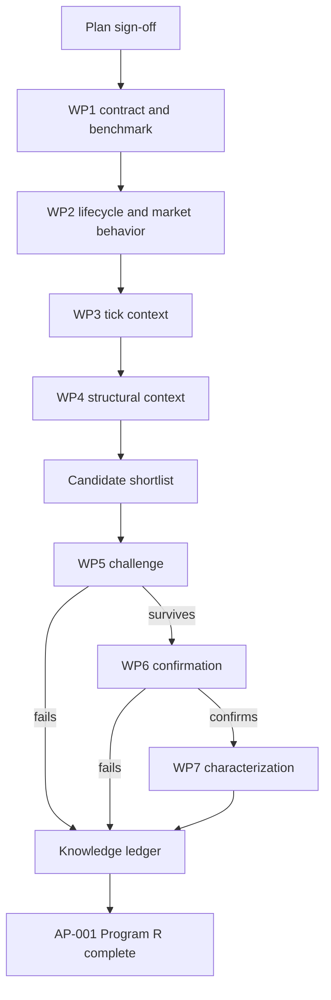

# AP-001 Drift-Burst Program R research plan

**Status:** Draft for sign-off  
**Project:** AP-001 Drift-Burst, XAUUSD  
**Boundary:** Program R only. No strategy or portfolio research.  
**Authority:** Frozen  
**Confirmation data:** Locked until the confirmation phase  
**Execution rule:** No research run starts until this plan is approved.

## 1. Objective and definition of done

The project determines what Drift-Burst tells us while its lifecycle is unfolding.

Primary anchors:

- `WEAK`
- `ONLINE`
- `STRONG`
- `DECAY_RISK`
- `DYING`

For each anchor, the study must answer:

1. What usually happens next inside Drift-Burst?
2. What happens to price after the state becomes knowable?
3. What were the other detectors doing at the anchor time?
4. How do those other detectors change after the anchor?
5. How do the price path and the detector-system path unfold together after the anchor?
6. Which same-domain tick conditions change those lifecycle, market, or detector-system outcomes?
7. Which already-known bar and structural conditions change those lifecycle, market, or detector-system outcomes?
8. Does Drift-Burst add information beyond those contexts?
9. Which findings survive untouched chronological confirmation?

The project therefore studies three distinct objects after every Drift-Burst anchor:

- **the Drift-Burst lifecycle itself;**
- **the future market-price path;**
- **the future detector-system path.**

These are not interchangeable. A price return says what the market did. A detector transition says how the market-information system evolved. The research must preserve both, then study their timing and relationship.

AP-001 Program R is complete only when the lifecycle, market consequences, detector-system consequences, same-domain context, structural context, joint price/detector sequencing, incremental-information tests, challenge, confirmation, and final characterization are finished. Every major claim must end as `CONFIRMED`, `REJECTED`, `NULL`, or `INCONCLUSIVE`.

A large result table is not completion.

## 2. Scope control

### Included

Lifecycle reconstruction, first-entry anchors, state occupancy as a separate measure, transition paths, recoveries, peak, termination, market-path behavior, tick context, bar and structural context, antecedent sequence discovery, prospective re-anchoring, matched controls, challenge testing, untouched confirmation, and post-confirmation characterization.

### Excluded

Strategy optimization, entries, exits, stop-losses, take-profits, sizing, P&L search, transaction-cost optimization, portfolio construction, Drift-Burst parameter tuning, detector redesign, new research architecture, and exhaustive field-by-field Cartesian searches.

### Change rule

A new idea goes to the backlog unless it is required by the active work package. A software defect permits only the smallest repair needed to restore scientific validity. Any scope change must state the reason, schedule impact, and affected deliverable before approval.

## 3. Frozen inputs and causal rules

### Data identities

| File | Git blob | Bytes | SHA256 of pushed content |
| --- | --- | ---: | --- |
| `instruments/XAUUSD/lake/manifest.json` | `7388e08d61b1c456094e1cd378f33535f752deb8` | 1,893,861 | `1176d6518c83ff1b5ec27b03df416c11d146b9611fb307398193c5cb9b5053af` |
| `instruments/XAUUSD/lake/payload_manifest.json` | `ad4cdaef1c987c3ab58d4375e65232eb3fe4c470` | 2,342,922 | `78d5fc20758831e06d487217d0367bbaab5f25cb7eefcac8bee9446f6eea3eed` |

The first execution package verifies these exact identities.

### Causal clock

At anchor time `t`, the study may use only information available by `t`.

For Drift-Burst tick records:

- `received_ts_ns` is the availability clock;
- `source_sequence` breaks ties;
- `event_ts_ns` is provenance.

Later completion fields never define earlier cohorts.

### Cohort rule

The primary cohort uses the first lawful entry into each anchor state. Repeated occupancy rows are not new events. Occupancy is retained for dwell and persistence analysis.

`drift_burst_completed` is a future lifecycle outcome. It is not an eligibility rule for an earlier state.

Incomplete and right-censored episodes remain in the study.

## 4. Time design

The project uses three time views. They answer different questions.

A fourth analytical distinction applies across all three clocks:

- **anchor-time context** = detector information already knowable at `t`;
- **post-anchor detector evolution** = detector changes after `t`, treated as outcomes or sequence evidence;
- **post-anchor price evolution** = market-price path after `t`;
- **joint evolution** = the ordered relationship among price movement, Drift-Burst transitions, and other-detector transitions after `t`.

Post-anchor detector information is never smuggled back into the anchor as if it had been known at `t`.

### Lifecycle clock

The internal lifecycle clock is event-driven and continues until the next transition, recovery, peak, termination, or DEVELOPMENT boundary.

For each anchor, record the prior path, state age, next transition, transition latency, peak and time to peak, decay and dying entries, recoveries, termination, `end_reason`, time to termination, and censor status.

This is the main study of what the detector itself does.

### Forward market horizons

| Horizon | Reason |
| --- | --- |
| `+5s` | Matches the producer's 5-second multiscale measurement. |
| `+15s` | Matches the producer's 15-second multiscale measurement. |
| `+30s` | Matches the producer's 30-second multiscale measurement. |
| `+60s` | Matches the producer's 60-second multiscale measurement. |
| `+120s` | Tests persistence beyond the producer's longest internal window. |
| `+300s` | Tests persistence into the seconds-to-minutes domain without becoming a strategy test. |

At every horizon, measure the whole path inside the window:

- endpoint return;
- signed and direction-adjusted return;
- maximum favorable excursion and its timing;
- maximum adverse excursion and its timing;
- continuation distance;
- reversal distance;
- realized volatility;
- path efficiency;
- whether favorable excursion occurs before adverse excursion;
- whether adverse excursion occurs first;
- missingness when the lawful window ends before the horizon.

Store raw values, normalized values, and the normalization basis.

### Antecedent windows

Use `-5s`, `-15s`, `-30s`, and `-60s` to study what changed before the anchor. These windows match the producer's multiscale structure.

Antecedent evidence is discovery only. If quote pressure often changes before `STRONG`, the later prospective test must re-anchor on quote pressure and ask how often `STRONG` follows compared with controls.

## 5. What the Drift-Burst study measures

At each primary anchor, record the available internal state:

- event ID and direction;
- score, z-score, efficiency, variance rate, cumulative absolute movement, update count, and operational duration;
- prior lifecycle path;
- 5s, 15s, 30s, and 60s multiscale measurements;
- multiscale agreement or disagreement.

The internal research questions are:

1. How often does each state progress, recover, deteriorate, or terminate?
2. Which transition paths dominate?
3. How long does each state persist?
4. Are `WEAK`, `ONLINE`, and `STRONG` stronger versions of one behavior or different populations?
5. Does `DECAY_RISK` identify deterioration, recoverable deterioration, or both?
6. Does `DYING` describe a distinct post-burst state?
7. Which internal attributes change transition probabilities or market behavior?
8. Does multiscale agreement matter?

The first output is a lifecycle and market atlas. It is not a significance contest.

## 6. Same-domain tick context and co-evolution

At every anchor, the study records both the **causal tick-context snapshot at `t`** and the **subsequent evolution of the tick-detector system after `t`**.

| Context | Role | At-anchor measurements | Post-anchor evolution |
| --- | --- | --- | --- |
| `micro_volatility` | volatility state | level, regime, pre-anchor change | regime transition, expansion/contraction timing |
| `quote_arrival` | market activity | rate, acceleration, persistence | acceleration/deceleration, persistence, transition timing |
| `quote_dynamics` | repricing behavior | direction, efficiency, change | repricing transition, persistence, reversal timing |
| `quote_pressure` | directional microstructure | level, alignment, opposition, persistence | alignment change, opposition change, persistence, reversal timing |
| `spread_state` | trading condition | level, widening, tightening, regime | widening/tightening transitions, persistence |
| `feed_health` | data-quality control | validity and contamination only | degradation/recovery status only |

Continuous variables stay continuous in evidence. Readable bins use predeclared DEVELOPMENT quantiles and never replace raw values.

Same-domain research asks two different classes of questions.

**Anchor-time conditioning**

Does tick context already known at `t` change:

- Drift-Burst transition probability;
- recovery;
- time to peak;
- time to termination;
- continuation;
- reversal;
- MFE;
- MAE;
- realized volatility?

**Post-anchor detector-system response**

After the Drift-Burst state becomes knowable:

- which tick-detector transitions occur next;
- how long they take;
- which transitions tend to occur before or after major price excursions;
- whether aligned or conflicting detector states emerge;
- whether the detector system converges, diverges, or remains mixed;
- whether the same post-anchor sequence repeats across chronological blocks.

Post-anchor detector changes are outcomes or sequence evidence. They are not predictors available at the original anchor.

If a post-anchor detector event repeatedly appears before an important price outcome, it becomes a candidate for a separate prospective re-anchor test. That later test anchors on the detector event itself and asks what follows from information available at that new time.

## 7. Bar and structural context and co-evolution

At each Drift-Burst anchor, snapshot the latest lawful bar information at 15s, 30s, 1m, 5m, 15m, 1h, and 4h. Native scale remains attached to every object.

The study then follows subsequent structural-detector changes after the anchor. This is necessary because a structural snapshot and a structural transition are different pieces of information.

| Context role | Detector families | At-anchor relations | Post-anchor structural evolution |
| --- | --- | --- | --- |
| location and zones | `fvg`, `range`, `order_blocks`, `dealing_range` | inside, outside, boundary, direction, age, normalized distance | first touch, fill, break, boundary interaction, object termination where lawful |
| structural transition | `swings`, `bos_choch`, `local_structure` | latest direction, transition age, distance to known pivot | new swing, BOS/CHOCH, local-structure transition, transition latency |
| liquidity | `structural_liquidity`, `micro_liquidity`, `micro_liquidity_context` | side, distance, nearest lawful source, active relation | liquidity interaction, removal, migration, or newly lawful state transition |
| volume and session | `volume_by_time`, `volume_trend`, `auction_context`, `time_context` | state, session position, volume regime | state change and timing |
| normalization | `vwma_atr` | volatility and distance normalization | normalization-regime change only; not an independent event signal |
| lineage | `raw3` and dependent references | dependency control, not an independent vote | lineage-preserving transition record |

The structural study asks three different questions.

**A. Context at the Drift-Burst anchor**

Does the Drift-Burst state behave differently depending on already-known structure?

Examples:

- inside versus outside an active FVG or range;
- near versus far from a lawful structural boundary;
- aligned versus opposed to structural direction;
- near versus away from liquidity;
- transition state versus stable structure;
- session and auction context.

**B. Structural evolution after the Drift-Burst anchor**

What does the surrounding structure do after the Drift-Burst state appears?

Examples:

- does an active FVG get touched or filled;
- does a range boundary break;
- does BOS/CHOCH occur;
- does liquidity get interacted with;
- how long after the Drift-Burst anchor do these events occur?

These are detector-system outcomes, not information available at `t`.

**C. Joint price / detector-system sequencing**

For each anchor, reconstruct the ordered path:

`Drift-Burst anchor -> price movement -> other-detector transitions -> Drift-Burst transitions -> later price movement`

The analysis records event order and latency rather than assuming one detector caused another.

Questions include:

- does price excursion usually precede or follow a structural transition;
- does Drift-Burst strengthen before or after an FVG interaction;
- do pressure changes tend to precede range breaks after a Drift-Burst anchor;
- do recoveries occur before or after opposing structural events;
- which recurring sequences are stable enough to become later prospective questions?

If a later detector event appears repeatedly before an outcome, that event must be prospectively re-anchored in its own lawful study before it can be treated as usable information.

The project does not test every detector field against every other field. It tests semantic relationships that could change the meaning of the anchor or explain how the detector system evolves around it.

## 8. Incremental-information controls

Conditional differences must survive stronger comparisons before they can become L3 evidence.

**Control A. Same Drift-Burst state, different context.**  
Example: `WEAK` near a known range boundary versus matched `WEAK` away from a boundary. Match on day or session, direction, initial intensity, micro-volatility, spread, and quote-arrival regime.

**Control B. Same context, with and without Drift-Burst.**  
Example: a known boundary with `WEAK` versus a comparable known boundary without `WEAK`. This tests whether Drift-Burst adds information beyond the structure.

**Control C. Same eligible episode across lifecycle states.**  
Compare episodes that lawfully reach multiple states. Keep this paired population separate from the general first-entry population. Do not use eventual completion to define the earlier general cohort.

## 9. Evidence levels and decision relevance

| Level | Meaning | Program |
| --- | --- | --- |
| L1 | Phenotype. A state or lifecycle population has a reproducible descriptive pattern. | Program R |
| L2 | Conditional information. The pattern changes under causally available context, or a stable post-anchor detector-system sequence is documented without treating later information as anchor-time information. | Program R |
| L3 | Incremental information. A prospectively anchored relationship survives matched controls and main measured confounders. | Program R |
| L4 | Confirmed information. A frozen L3 relationship reproduces on untouched chronological data. | Program R |
| L5 | Executable edge. A decision rule survives costs, latency, slippage, and execution. | Program S |
| L6 | Portfolio component. The strategy adds useful portfolio behavior. | Program P |

Program R stops at L4 plus characterization.

Every supported finding also receives one decision-relevance tag:

- `ENTRY_TIMING_CANDIDATE`
- `WAIT_FOR_STATE_CANDIDATE`
- `EXIT_MANAGEMENT_CANDIDATE`
- `REGIME_FILTER_CANDIDATE`
- `STRUCTURE_FILTER_CANDIDATE`
- `ABSTENTION_CANDIDATE`
- `NO_DECISION_RELEVANCE_FOUND`

A tag states how later strategy research may use the information. It is not a trading rule.

## 10. Work breakdown structure

| WP | Purpose | Required output | Exit condition |
| --- | --- | --- | --- |
| **WP1 Contract and benchmark** | Bind the plan to real data and measure scan cost. | Verified input identities, anchor sanity, rows/s, memory, full-run ETA. | Causal ordering and first-entry reconstruction pass. |
| **WP2 Lifecycle and market discovery** | Produce the first complete Drift-Burst behavioral result. | Lifecycle paths, transition timing, dwell, termination, six-horizon market paths, internal-attribute splits, readable E1 report. | Every anchor has a result or `INSUFFICIENT_SUPPORT`. |
| **WP3 Same-domain conditioning and co-evolution and co-evolution** | Determine how tick context changes the anchor and how the tick-detector system evolves afterward. | Conditional lifecycle/market tables, post-anchor tick-transition tables, event-order and latency summaries, support and stability summaries. | Every tick family ends with an anchor-context result and a post-anchor sequence result, or an explicit null/insufficient-support/quality-excluded status. |
| **WP4 Structural conditioning and co-evolution and co-evolution** | Determine how known bar structure changes the anchor and how structural detectors evolve afterward. | Scale-preserved structural-context tables, post-anchor structural-transition tables, joint price/detector sequence summaries, lineage notes, candidate list. | The report states which contexts matter, which detector-system sequences recur, which do not, and which lack support. |
| **WP5 Candidate challenge** | Try to destroy promoted findings and test incremental information. | Matched controls, block-aware nulls, multiplicity-adjusted challenge results. | Each candidate is `SURVIVED_CHALLENGE`, `REJECTED`, `NULL`, or `INCONCLUSIVE`. |
| **WP6 Confirmation** | Test frozen survivors on untouched data. | One frozen confirmation result per survivor. | Each is `CONFIRMED`, `FAILED_CONFIRMATION`, or `INCONCLUSIVE_CONFIRMATION`. |
| **WP7 Characterization and closure** | Explain confirmed information and negative knowledge. | Final report, knowledge ledger, decision-relevance matrix. | Definition of done is satisfied. |

### Research flow

## 11. Discovery, challenge, and confirmation rules

WP2 through WP4 are discovery. They emphasize effect size, support, distribution shape, chronological stability, and understandable contrasts. They do not run expensive null machinery on every table.

Before WP3 and WP4 outcomes are opened, WP2 freezes the support and noise reference used for candidate screening.

A relationship enters WP5 only when:

- support meets the frozen minimum;
- support spans enough distinct chronological blocks;
- no single day or session dominates;
- magnitude is material relative to the baseline movement distribution;
- direction is reasonably stable;
- the information path is understandable;
- detector lineage does not duplicate the same source;
- the finding has a defined decision-relevance question.

WP5 uses matched controls, within-session or within-day comparisons, block-aware nulls, and chronological development folds. Primary predeclared hypotheses use Holm familywise control at 0.05. Broader discovery-derived families use BH-FDR at 0.05. The resample count is frozen before each challenge family runs and is based on required p-value resolution and compute cost.

Only `SURVIVED_CHALLENGE` candidates enter WP6.

WP6 opens the locked confirmation partition once. Candidate definition, population, direction, horizon, context, statistic, and acceptance rule are frozen before access. Failed candidates are not retuned on confirmation data.

## 12. Resource plan

| Role | Use |
| --- | --- |
| Rust toolsmith and executor | Builds and runs deterministic evidence code for WP1 to WP6. |
| Research analyst | Interprets each frozen phase result and writes candidate statements. |
| Independent skeptic | Used for WP5 and final confirmation review, not for every descriptive table. |
| Research director | Approves the plan, scope changes, candidate promotion, and final claims. |

Default concurrency is two active workers. A third worker is allowed only for independent work that does not share mutable evidence.

## 13. Schedule and progress control

The schedule comes from the seven work packages. It is not tied to market open or an arbitrary number of days.

Initial three-point estimates cover active engineering and research time, excluding human review:

| Work package | Optimistic | Most likely | Pessimistic |
| --- | ---: | ---: | ---: |
| WP1 | 0.5 h | 0.75 h | 1.5 h |
| WP2 | 1.5 h | 2.5 h | 4 h |
| WP3 | 1.5 h | 2.5 h | 4 h |
| WP4 | 2 h | 3.5 h | 6 h |
| WP5 | 1.5 h | 3 h | 5 h |
| WP6 | 1 h | 1.5 h | 2.5 h |
| WP7 | 1.5 h | 2.5 h | 4 h |

PERT weighting gives an initial forecast of about **17 active work-hours**.

This is a planning forecast, not a promise. WP1 replaces scan-time assumptions with measured runtime before WP2 begins. The project is reforecast only if measured runtime or a scientific defect changes the total forecast by more than 25 percent.

If a work package reaches its pessimistic estimate without meeting its exit condition, stop and issue a change decision. Do not continue by habit.

Progress is measured by completed scientific deliverables:

1. benchmark and anchor sanity;
2. lifecycle and market behavior;
3. tick conditioning;
4. structural conditioning;
5. challenged candidates;
6. confirmation;
7. final knowledge.

Infrastructure-only work does not count as research progress unless it repairs a documented validity defect.

## 14. Risk register

| Risk | Control | Contingency |
| --- | --- | --- |
| future information leakage | availability ordering by `received_ts_ns` and `source_sequence` | reject affected evidence and repair the offending join |
| future conditioning | first-entry cohorts never require later completion | rebuild only the affected cohort |
| left truncation | mark missing prior lifecycle history | exclude only analyses that require unavailable history |
| right censoring | explicit censor and missing-horizon status | use censor-aware analysis where required |
| occupancy duplication | one first-entry anchor per state | keep occupancy for dwell analysis only |
| temporal dependence | chronological blocks and session-aware matching | block-aware challenge nulls |
| drift or session confounding | direction, day, session, and regime controls | downgrade, condition, or reject |
| lineage duplication | dependency map and provenance | collapse dependent context into one information family |
| low-support interactions | frozen support rule and distinct-period requirements | mark `INSUFFICIENT_SUPPORT` |
| search explosion | semantic context families and controlled candidate promotion | register extra ideas for later work |
| scanner performance | WP1 benchmark before full run | optimize the local hot path only |
| AI over-interpretation | every claim links to deterministic evidence | skeptic downgrades unsupported wording |
| confirmation contamination | locked custody | invalidate confirmation status if breached |
| infrastructure creep | scope and defect rules | backlog unrelated engineering |

## 15. Project controls

The project keeps four management records only:

1. this plan;
2. one work-package status file;
3. one decision log;
4. the risk register.

A phase gate asks one question: did the work package produce the evidence required by its exit condition?

A defect follows this procedure:

1. state the invalid scientific consequence;
2. reproduce it;
3. repair the smallest responsible component;
4. rerun the affected evidence;
5. return to the plan.

No unrelated architecture review follows a defect.

## 16. Final deliverables

The final AP-001 package contains:

- `AP-001_FINAL_RESEARCH_REPORT.md`
- `AP-001_KNOWLEDGE_LEDGER.json`
- `AP-001_DECISION_RELEVANCE_MATRIX.md`
- one decision log that links final claims to evidence

The final report must explain:

- what `WEAK`, `ONLINE`, `STRONG`, `DECAY_RISK`, and `DYING` mean behaviorally;
- which internal attributes matter;
- which tick conditions change those meanings;
- which market structures change those meanings;
- how the tick and structural detector system evolves after each Drift-Burst state;
- which recurring price/detector event sequences are observed and in what order;
- which post-anchor observations were prospectively re-anchored before being treated as usable information;
- whether Drift-Burst adds information beyond context alone;
- which findings survived challenge;
- which findings survived untouched confirmation;
- which conditions make confirmed findings weaken or fail;
- which findings later strategy research may investigate;
- which studies produced null, rejected, or inconclusive results.

## 17. Sign-off

Research starts only after these items are accepted:

- [ ] primary anchors
- [ ] causal and cohort rules
- [ ] lifecycle clock
- [ ] six market horizons and their reasons
- [ ] market-path measurements
- [ ] tick-context design
- [ ] post-anchor tick-detector co-evolution design
- [ ] structural-context design
- [ ] post-anchor structural-detector co-evolution design
- [ ] joint price/detector sequencing rule
- [ ] prospective re-anchor rule for post-anchor detector discoveries
- [ ] incremental-information controls
- [ ] evidence levels and decision-relevance tags
- [ ] seven work packages
- [ ] discovery, challenge, and confirmation separation
- [ ] resource plan
- [ ] risk controls
- [ ] schedule and reforecast rule
- [ ] strategy and portfolio exclusion

**Decision:** `APPROVED`, `REWORK`, or `REJECTED`.

## 18. Planning basis and reusable skill

The management structure follows established practice without importing unnecessary enterprise process.

- PMI and GAO guidance use a deliverable-oriented work breakdown structure to define scope, resources, activities, and schedule.
- NASA technical-planning guidance starts with roles, tools, activities, products, reviews, and success criteria, then updates plans from measured execution data.
- Verification and validation criteria are defined before formal validation rather than invented after results appear.
- Risks have defined controls and responses.
- Scope changes require explicit authority.

References:

- Project Management Institute, *Work Breakdown Structure, Basic Principles*: https://www.pmi.org/learning/library/work-breakdown-structure-basic-principles-4883
- U.S. GAO, *Schedule Assessment Guide*: https://www.gao.gov/products/gao-16-89g
- NASA, *Systems Engineering Handbook*: https://www.nasa.gov/reference/systems-engineering-handbook/
- NASA, *Technical Planning*: https://www.nasa.gov/reference/6-1-technical-planning/

After AP-001 uses this plan once, convert the stable parts into a detector-research skill. The skill should adapt `figure-it-out` for scope, definition of done, work decomposition, risk, and auditability; `technical-writing` for project documents; `teach` for human-readable result explanations; and `unslop` for plain language.

The skill must remain detector-aware. It must not force future detectors through Drift-Burst-specific anchors, horizons, or context rules.
