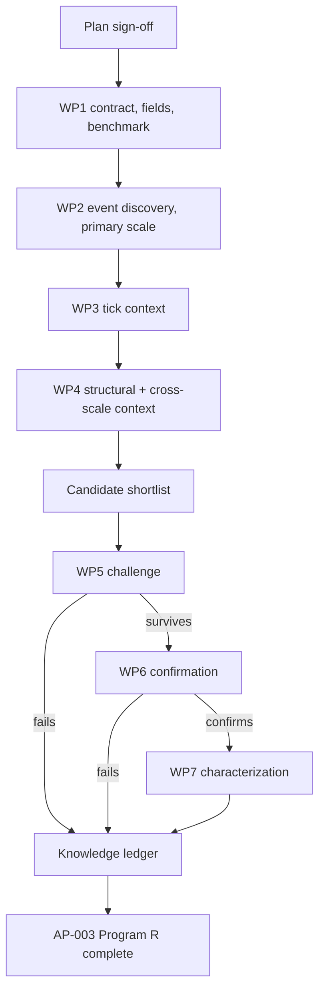

# AP-003 BOS/CHOCH Program R research plan — V3

**Status:** Draft for sign-off
**Project:** AP-003 BOS/CHOCH, XAUUSD
**Boundary:** Program R only. No strategy or portfolio research.
**Authority:** Frozen
**Confirmation data:** Locked until the confirmation phase
**Execution rule:** No research run starts until this plan is approved.

## 1. Objective and definition of done

`bos_choch` is an EVENT detector, not a lifecycle object and not a multi-state regime. It marks a structural transition (a break of structure or a change of character) at a point in time, on a bar surface that carries seven native scales at once: `15s, 30s, 1m, 5m, 15m, 1h, 4h`. AP-001 treated it only as context for Drift-Burst. This project makes it the anchor.

The project determines what a `bos_choch` event tells us, at the scale it actually has power in, about four things:

1. what price does on the event's own native-bar clock;
2. what price and microstructure do on a bounded tick-time clock immediately after the event becomes knowable;
3. what the surrounding detector system does after the event, including whether information transfers from bar structure into tick behavior;
4. whether the event carries information beyond structure and tick conditions already knowable at the same moment.

For each event, the study must answer:

1. Is the event a BOS or a CHOCH, and does that distinction change the outcome?
2. What is the price path after the event at native-scale bar horizons?
3. What happens during the immediate tick-scale microreaction after the event becomes lawfully knowable?
4. Which tick-detector states emerge or change during that microreaction, and do they separate materially different paths?
5. What do the other structural detectors (`swings`, `local_structure`, zone objects) do after the event?
6. Does agreement or disagreement with the same detector at a coarser or finer native scale change the outcome?
7. Does `bos_choch` add information beyond the structural and tick context already available at event time?
8. Which findings survive untouched chronological confirmation?

AP-003 Program R is complete only when event discovery, tick conditioning, structural and cross-scale conditioning, incremental-information testing, challenge, confirmation, and characterization are finished, and every major claim ends as `CONFIRMED`, `REJECTED`, `NULL`, or `INCONCLUSIVE`. A result table across all seven scales is not completion; the plan commits to one primary scale first (Section 5) precisely so the project does not become a seven-way combinatorial search before it has evidence at any one scale.

## 2. Scope control

### Included

Event-field enumeration, primary-scale selection, event incidence and clustering, direction and subtype (BOS vs CHOCH) splits, native-bar-horizon price paths, tick context at event time, structural and cross-scale context, joint price/detector sequencing, matched controls, challenge, untouched confirmation, characterization.

### Excluded

Strategy optimization, entries, exits, sizing, transaction-cost search, portfolio construction, redesign of the `bos_choch` detector itself, and full seven-scale Cartesian studies run in parallel before the primary scale has a result.

### Change rule

Same as AP-001: a new idea goes to the backlog unless the active work package requires it. A defect permits only the smallest repair needed to restore scientific validity. Any scope change states the reason, schedule impact, and affected deliverable before approval, per the Research Project Execution skill's scope-change protocol.

## 3. Detector role and scientific unit

Role: `EVENT`. One scientific unit is one lawful, first-recorded `bos_choch` event on one native scale. Repeated same-direction confirmations inside a single structural cycle are not new events; they are retained separately as a persistence/re-confirmation measure, not folded into the primary event count.

`bos_choch` is not a persistent object. It has no formation-to-termination lifecycle the way `fvg` or `order_blocks` do. The correct unit is the event itself plus its forward and backward windows, not a dwelling state.

## 4. Frozen inputs and causal rules

### Data identities

| File | Git blob | Bytes | SHA256 of pushed content |
| --- | --- | ---: | --- |
| `instruments/XAUUSD/lake/manifest.json` | `7388e08d61b1c456094e1cd378f33535f752deb8` | 1,893,861 | `1176d6518c83ff1b5ec27b03df416c11d146b9611fb307398193c5cb9b5053af` |
| `instruments/XAUUSD/lake/payload_manifest.json` | `ad4cdaef1c987c3ab58d4375e65232eb3fe4c470` | 2,342,922 | `78d5fc20758831e06d487217d0367bbaab5f25cb7eefcac8bee9446f6eea3eed` |

Same corpus as AP-001. The first execution package verifies these exact identities before anything else runs.

### Causal clock

`bos_choch` lives on the bar surface. The native bar timestamp and the research-availability timestamp are related but must not be assumed to be identical.

- `bar_close_ts` defines the event's native bar-close provenance.
- `bar_open_ts` is provenance only.
- WP1 must bind the actual research-availability coordinate to the frozen producer/replay semantics before behavioral scanning begins.
- If the frozen producer/replay evidence proves that `bar_close_ts` is the lawful availability coordinate, use it directly.
- If the event only becomes knowable when a later boundary-crossing tick is received, use the verified receipt/sidecar availability coordinate instead.
- Cross-scale joins use each scale's own verified availability coordinate. A finer scale's clock is never substituted for a coarser scale's clock, and vice versa.

No behavioral artifact may be produced until WP1 records the verified availability rule.

### Payload field gap

Unlike Drift-Burst, this program does not have a pre-confirmed list of `payload_bos_choch` internal fields (subtype, magnitude, confirmation strength). The registry marks `bos_choch` semantics `UNRESOLVED`. WP1 enumerates the actual frozen fields before any measurement design past this plan is finalized. This plan defines the research shape; WP1 supplies the exact field names.

## 5. Left- and right-boundary policy, and primary-scale selection

### Left boundary

The first structural cycle in each native scale's observed window may lack the prior trend context needed to correctly distinguish CHOCH (character change) from BOS (continuation break). Events inside that first cycle are flagged `LEFT_TRUNCATED_STRUCTURE` and excluded from the CHOCH-vs-BOS split until a full prior cycle is observed. They remain eligible for the plain incidence count.

### Right boundary

Events whose full native-bar forward horizon (Section 6) would extend past the DEVELOPMENT boundary (`2026-05-05T12:39:00Z` per `instruments/XAUUSD/data_scope_v1.json`) are retained with explicit `CENSORED_HORIZON` status rather than dropped.

### Primary-scale selection rule

Studying all seven scales in parallel before any single scale has a result is the search-explosion failure mode AP-001's risk register warns about. This plan predeclares the rule instead of the number:

> The primary phenotype scale is the coarsest native scale whose development-window first-occurrence event count meets or exceeds 300. 300 is the frozen minimum this program uses wherever a p05/p95 tail estimate is required; a coarser scale is preferred over a finer one at equal support because coarser events carry less same-cycle noise. If no scale reaches 300, use 150 as a fallback minimum and mark excluded scales `INSUFFICIENT_SUPPORT`.

WP1 measures the actual per-scale counts and applies this rule mechanically. The selected scale is the **discovery-leading primary scale**, not the only scale that can contribute to final detector knowledge.

The other six scales are first used as cross-scale context rather than parallel primary studies. Before AP-003 can close Program R, every other scale that meets the frozen support rule must receive a bounded phenotype-replication / heterogeneity check. That check asks whether the primary-scale finding is:

- directionally consistent;
- materially weaker or stronger;
- absent;
- reversed;
- or structurally different at that native scale.

This is not seven independent full research programs. It is a required final scale-portability check so the primary scale is not silently treated as representative of the whole detector family.

## 6. Measurement clocks

### Forward horizons (native-bar count, not wall-clock)

A fixed wall-clock horizon (`+300s`) is meaningless on a `4h` bar and noise on a `15s` bar. Horizons here are counted in bars of the event's own native scale, so the design is comparable across scales without conflating wall-clock time with market-information time.

| Horizon | Reason |
| --- | --- |
| `+1 bar` | Immediate reaction. |
| `+2 bars` | Matches the same-cycle window used for CHOCH confirmation checks. |
| `+3 bars` | Short continuation window. |
| `+5 bars` | Medium continuation window, comparable to AP-001's mid-range wall-clock horizons in information content even though the unit differs. |
| `+10 bars` | Tests persistence beyond the immediate reaction without becoming a strategy-holding-period test. |

At every horizon: endpoint return, direction-adjusted return, MFE and its timing, MAE and its timing, whether MFE precedes MAE, realized volatility inside the window, and missingness when the lawful window ends before the horizon (censored per Section 5). Store raw, normalized, and the normalization basis (`vwma_atr`-derived where available).

### Cross-resolution bridge: bar anchor -> tick outcome

The native-bar count remains the **primary structural research horizon**. A second, bounded tick-time outcome clock is also mandatory at the primary discovery scale because a bar-defined structural event can carry short-lived information that disappears inside the next completed bar.

The bridge is measured from the event's **verified lawful availability time**, not from nominal bar open time.

#### Native-bar outcome clock

Unchanged:

- `+1 bar`
- `+2 bars`
- `+3 bars`
- `+5 bars`
- `+10 bars`

These horizons answer whether the structural event carries information over its own native market-information scale.

#### Tick microreaction clock

Use:

- `+5s`
- `+15s`
- `+30s`
- `+60s`

These windows are bounded to the existing tick multiscale domain and answer a different question: whether the newly knowable structural event creates or conditions an immediate microstructure response.

At each tick microreaction horizon, record:

- raw and direction-adjusted return;
- tick-resolved MFE and MAE;
- time to MFE and MAE;
- which excursion occurs first;
- initial favorable and adverse excursion;
- path efficiency;
- realized tick volatility;
- spread state and change;
- quote-arrival state and change;
- quote-dynamics state and change;
- quote-pressure alignment/opposition and change;
- micro-volatility state and change;
- Drift-Burst state at the anchor and any lawful post-anchor state transition.

The bar and tick clocks are reported separately. A strong tick microreaction with weak native-bar continuation is a valid result, as is the reverse.

#### Intrabar ordering fallback

If tick resolution is unavailable for a specific artifact, retain the mandatory bar-resolution output:

- bar-index MFE and MAE;
- bar-index timing;
- endpoint and normalized return;
- `ORDER_UNKNOWN_SAME_BAR` when both extrema occur inside the same native bar and bar data cannot establish which came first.

#### Prospective re-anchor rule

A post-event tick state is an **outcome** of the BOS/CHOCH anchor, not information available at the original event.

Example:

`BOS/CHOCH -> quote-pressure alignment -> Drift-Burst ONLINE -> price excursion`

The BOS/CHOCH study may discover and characterize that sequence. It may not treat the later pressure alignment or `ONLINE` state as if known at BOS/CHOCH time.

If a later tick state repeatedly precedes a material outcome, create a separate prospective bridge test anchored when that tick state itself becomes lawful, with the BOS/CHOCH event retained only as already-known structural context.

This is the route by which a bar-defined structural event can generate a later tick-triggered research candidate without future conditioning.

### Antecedent windows (native-bar count)

`-1, -3, -5, -10` bars, same scale. Used to characterize the pre-event setup: prior swing direction, distance to the last known pivot, and volume/volatility regime immediately before the event. Antecedent evidence is discovery only; a recurring antecedent pattern becomes its own prospective re-anchor test, exactly as AP-001 requires for post-anchor detector discoveries.

## 7. What the study measures

At each primary-scale event: direction, event subtype (BOS vs CHOCH, once WP1 confirms the field exists and how it is encoded), distance from the break level to the prior pivot (normalized), bars since the last opposing-direction event at the same scale, and same-timestamp state of `swings` and `local_structure`.

Cross-scale agreement, recorded but not yet a primary population:

- does a primary-scale event coincide with, precede, or follow an event at the next coarser scale;
- does a primary-scale event coincide with, precede, or follow an event at the next finer scale;
- how often does a finer-scale event get contradicted by the next coarser-scale event within its own forward horizon.

Internal research questions:

1. Do BOS and CHOCH behave as different populations or as the same behavior at different intensity?
2. Does event magnitude (normalized break distance) change the forward path?
3. Does time-since-last-opposing-event (recurrence/clustering) change the forward path?
4. Does agreement with a coarser scale change the forward path more than agreement with a finer scale?
5. Is a primary-scale event that is **later** contradicted by the next coarser scale within its own horizon meaningfully different from one that is not contradicted?

The later-contradicted classification is an outcome-defined cohort used for retrospective sequence characterization only. It is not information available at the original `bos_choch` anchor. If later contradiction appears useful, the contradiction event itself must be prospectively re-anchored at its own lawful availability time before it can become an information claim.

## 8. Same-domain tick context and co-evolution

At every primary-scale event, snapshot the tick-context state at the instant the event's defining bar closed, and follow its evolution afterward. The six tick families and their roles are unchanged from AP-001; only the anchor changes.

| Context | Role | At-anchor measurements | Post-anchor evolution |
| --- | --- | --- | --- |
| `micro_volatility` | volatility state | level, regime, pre-event change | regime transition, expansion/contraction timing |
| `quote_arrival` | market activity | rate, acceleration, persistence | acceleration/deceleration, persistence |
| `quote_dynamics` | repricing behavior | direction, efficiency, change | repricing transition, reversal timing |
| `quote_pressure` | directional microstructure | level, alignment with event direction | alignment change, persistence, reversal timing |
| `spread_state` | trading condition | level, widening/tightening | widening/tightening transitions |
| `feed_health` | data-quality control | validity only | degradation/recovery status only; any event inside a degraded window is flagged, not silently kept |

Anchor-time conditioning asks whether tick context already known at the event's verified availability time changes either the native-bar outcome or the bounded `+5/+15/+30/+60s` microreaction.

Post-anchor response asks what the tick-detector system does next inside those microreaction windows and later inside the native-bar horizon. These are outcome and sequence variables, never smuggled back into the original anchor.

The key cross-resolution question is whether the bar event transfers information into a repeatable tick-scale state before the bar-scale outcome is visible.

## 9. Structural context and cross-scale co-evolution

At each primary-scale event, snapshot zone and liquidity context: is the event forming inside, outside, or at the boundary of an active `fvg`, `range`, `order_blocks`, or `dealing_range`; distance to the nearest lawful liquidity source; session and volume state (`auction_context`, `time_context`, `volume_by_time`, `volume_trend`); normalization basis (`vwma_atr`).

Three questions, matching AP-001's structure:

**A. Context at the event.** Does a break that occurs at an already-known zone boundary or near liquidity behave differently from one that occurs in open space?

**B. Structural evolution after the event.** Does an adjacent zone get touched, filled, or invalidated after the break; does liquidity get interacted with; how long does that take, in native bars?

**C. Joint sequencing.** Reconstruct the ordered path:

`bar event -> tick microreaction -> tick-detector transitions -> native-bar price movement -> other structural-detector transitions -> possible contradicting event at another scale -> later price movement`

Record event order and latency; do not assume causation.

This sequencing is used to distinguish:

- **information persistence** — the BOS/CHOCH event remains informative as time advances;
- **information transfer** — information originating at the bar event becomes visible in a different resolution, such as tick pressure or Drift-Burst, before the later bar outcome.

A recurring post-event tick or structural sequence becomes its own prospective re-anchor candidate, not a retroactively-applied predictor.

## 10. Incremental-information controls

**Control A.** Same event type (BOS or CHOCH), different structural context: at a known zone boundary versus away from one. Match on session, direction, prior volatility regime, and spread state.

**Control B.** Same structural context, with and without a `bos_choch` event: a known zone boundary that gets touched with a recent break nearby versus one touched without a recent break. Tests whether the event adds information beyond the structure alone.

**Control C.** Cross-scale agreement/contradiction sequence comparison, matched on direction and magnitude. Because contradiction is known only later, this control characterizes retrospective outcome paths; it does not convert future contradiction into an event-time predictor. Any usable contradiction hypothesis must be prospectively re-anchored at the contradiction's lawful availability time.

Rule 11 from `protocol/RESEARCH_RULES.md` applies directly here: `bos_choch` derives in part from the same underlying swing/structure computation as `swings` and `local_structure`. A candidate that only restates known swing information is not independent confluence, and must be flagged as such before promotion.

## 11. Evidence levels and decision relevance

Same six-level model as AP-001 (L1 Phenotype through L6 Portfolio component; Program R stops at L4 plus characterization). Decision-relevance tags are unchanged: `ENTRY_TIMING_CANDIDATE`, `WAIT_FOR_STATE_CANDIDATE`, `EXIT_MANAGEMENT_CANDIDATE`, `REGIME_FILTER_CANDIDATE`, `STRUCTURE_FILTER_CANDIDATE`, `ABSTENTION_CANDIDATE`, `NO_DECISION_RELEVANCE_FOUND`.

## 12. Work breakdown structure

| WP | Purpose | Required output | Exit condition |
| --- | --- | --- | --- |
| **WP1 Contract, field enumeration, benchmark** | Verify data identities; enumerate actual `payload_bos_choch` fields; measure per-scale event counts and scan cost. | Verified identities, field list, per-scale event-count table, primary-scale decision, rows/s, full-run ETA. | Primary scale selected by the Section 5 rule; causal ordering and first-occurrence reconstruction pass. |
| **WP2 Event discovery** | Produce the first complete BOS/CHOCH behavioral result at the primary scale on both native-bar and bounded tick microreaction clocks. | Incidence, clustering, BOS-vs-CHOCH split, native-bar price paths, `+5/+15/+30/+60s` tick microreaction price paths, readable E1 report. | Every primary-scale event class has both a native-bar result and a microreaction result, or `INSUFFICIENT_SUPPORT`. |
| **WP3 Tick conditioning, co-evolution, and bridge discovery** | Determine how tick context changes the event outcome, how the tick-detector system evolves after it, and whether a repeatable bar->tick information-transfer sequence exists. | Conditional tables, post-event tick-transition tables, bridge sequence table, event-order/latency summaries, prospective re-anchor candidates. | Every tick family ends with an anchor-context result and a post-event sequence result, or an explicit null/insufficient-support/quality-excluded status; every promoted post-event tick pattern is labeled retrospective or prospectively re-anchored. |
| **WP4 Structural and cross-scale conditioning** | Determine how zone/liquidity context and cross-scale agreement change the outcome. | Structural-context tables, cross-scale agreement tables, joint sequencing summaries, lineage notes (Rule 11), candidate list. | The report states which contexts matter, which cross-scale patterns recur, and which lack support. |
| **WP5 Candidate challenge** | Try to destroy promoted findings; test incremental information against Rule 11 lineage overlap. | Matched controls, block-aware nulls, multiplicity-adjusted results. | Each candidate is `SURVIVED_CHALLENGE`, `REJECTED`, `NULL`, or `INCONCLUSIVE`. |
| **WP6 Confirmation** | Test frozen survivors on untouched data. | One frozen confirmation result per survivor. | Each is `CONFIRMED`, `FAILED_CONFIRMATION`, or `INCONCLUSIVE_CONFIRMATION`. |
| **WP7 Characterization, supported-scale replication, and closure** | Explain confirmed information and negative knowledge; classify the detector's native and cross-resolution information domains; test whether primary-scale conclusions port to every other supported scale. | Final report, knowledge ledger, decision-relevance matrix, supported-scale replication/heterogeneity table, information-persistence/transfer summary. | Definition of done is satisfied; no supported native scale remains unclassified; confirmed findings state whether information is native-bar, tick-microreaction, cross-resolution, or absent. |

## 13. Discovery, challenge, and confirmation rules

Same separation as AP-001: WP2 through WP4 are discovery, cheap and broad. WP2 freezes the support and noise reference before WP3/WP4 outcomes open. A relationship enters WP5 only when support meets the frozen minimum (300, falling back to 150 per Section 5), spans enough distinct chronological blocks, no single day or session dominates, magnitude is material against baseline movement, direction is stable, the information path is understandable, and it passes the Rule 11 lineage check. WP5 uses Holm familywise control at 0.05 for primary predeclared hypotheses and BH-FDR at 0.05 for discovery-derived families. Only `SURVIVED_CHALLENGE` candidates enter WP6, which opens confirmation once, fully frozen before access.

## 14. Resource plan

Unchanged from AP-001: Rust toolsmith/executor, research analyst, independent skeptic (WP5 and confirmation review only), research director. Default concurrency two active workers; a third only for independent work sharing no mutable evidence.

## 15. Schedule and progress control

| Work package | Optimistic | Most likely | Pessimistic |
| --- | ---: | ---: | ---: |
| WP1 | 0.75 h | 1.25 h | 2 h |
| WP2 | 1.5 h | 2.5 h | 4 h |
| WP3 | 1.5 h | 2.5 h | 4 h |
| WP4 | 2 h | 3.5 h | 6 h |
| WP5 | 1.5 h | 3 h | 5 h |
| WP6 | 1 h | 1.5 h | 2.5 h |
| WP7 | 1.5 h | 2.5 h | 4 h |

PERT gives an initial forecast of about **18 active work-hours**, slightly above AP-001 because of the added field-enumeration and primary-scale-selection work in WP1. This is a forecast, not a promise. Reforecast only if measured runtime or a scientific defect changes the total by more than 25 percent. If a work package reaches its pessimistic estimate without meeting its exit condition, stop and issue a change decision.

Progress is measured by completed scientific deliverables (primary-scale selection, event/market discovery, tick conditioning, structural conditioning, challenged candidates, confirmation, final knowledge), not elapsed time. Infrastructure-only work does not count as progress unless it repairs a documented validity defect.

## 16. Risk register

| Risk | Control | Contingency |
| --- | --- | --- |
| unverified payload fields | WP1 enumerates actual fields before design commits further | if a field the plan assumed does not exist, the affected measurement is dropped, not invented |
| primary-scale mis-selection | frozen rule in Section 5, applied mechanically to measured counts | reselect scale only through a change decision, not silently |
| wall-clock/bar-count confusion | primary horizons defined in native-bar counts; tick data are path resolution only unless a separate microreaction study is registered | reject any artifact that substitutes wall-clock time for the native-bar phenotype |
| future information leakage | availability by `bar_close_ts` only | reject affected evidence, repair the join |
| left-truncated first cycle | `LEFT_TRUNCATED_STRUCTURE` flag, excluded from BOS/CHOCH split only | include in plain incidence count only |
| right censoring | explicit `CENSORED_HORIZON` status | censor-aware analysis where required |
| lineage duplication with `swings`/`local_structure` | Rule 11 dependency check before promotion | collapse dependent context into one information family |
| search explosion across seven scales | one primary scale first, others as context only | register cross-scale ideas for later work, not parallel studies |
| cross-resolution search explosion | fixed `+5/+15/+30/+60s` bridge only at the primary discovery scale; expensive challenge only for promoted relationships | do not add arbitrary wall-clock grids or cross every tick field with every bar field |
| post-anchor tick-state leakage | later tick transitions are outcomes until prospectively re-anchored | reject any claim that treats a post-event tick state as known at the BOS/CHOCH anchor |
| low-support interactions | frozen 300/150 minimum, distinct-period requirement | mark `INSUFFICIENT_SUPPORT` |
| AI over-interpretation | every claim links to deterministic evidence | skeptic downgrades unsupported wording |
| confirmation contamination | locked custody | invalidate confirmation status if breached |
| infrastructure creep | scope and defect rules | backlog unrelated engineering |

## 17. Project controls

Four records only: this plan, one work-package status file, one decision log, the risk register. A phase gate asks one question: did the work package produce the evidence its exit condition requires? A defect follows the same five-step procedure as AP-001: state the invalid consequence, reproduce it, repair the smallest responsible component, rerun affected evidence, return to the plan.

## 18. Final deliverables

- `AP-003_FINAL_RESEARCH_REPORT.md`
- `AP-003_KNOWLEDGE_LEDGER.json`
- `AP-003_DECISION_RELEVANCE_MATRIX.md`
- one decision log linking final claims to evidence

The final report must explain: which native scale was selected and why; what BOS and CHOCH mean behaviorally and whether they are one population or two; what happens on the native-bar clock; what happens on the bounded tick microreaction clock; whether information persists within one resolution or transfers from bar structure into tick behavior; which tick conditions change that meaning; which structural contexts and cross-scale agreements change it; which recurring price/detector sequences were observed; which post-event observations were prospectively re-anchored; whether `bos_choch` adds information beyond context and swing lineage alone; which findings survived challenge and confirmation; which conditions make confirmed findings weaken; what later strategy research may investigate; which studies produced null, rejected, or inconclusive results.

## 19. Sign-off

Research starts only after these items are accepted:

- [ ] event definition and scientific unit
- [ ] causal availability rule verified against producer/replay semantics
- [ ] field-enumeration rule
- [ ] left/right boundary policy
- [ ] primary-scale selection rule
- [ ] supported-scale phenotype-replication / heterogeneity rule
- [ ] native-bar forward and antecedent horizons and their reasons
- [ ] bounded `+5/+15/+30/+60s` bar->tick microreaction bridge
- [ ] tick path-resolution rule and `ORDER_UNKNOWN_SAME_BAR` handling
- [ ] post-anchor tick-state prospective re-anchor rule
- [ ] information-persistence versus information-transfer distinction
- [ ] tick-context design and co-evolution
- [ ] structural and cross-scale context design and co-evolution
- [ ] joint price/detector sequencing rule
- [ ] incremental-information controls, including Rule 11 lineage check
- [ ] evidence levels and decision-relevance tags
- [ ] seven work packages
- [ ] discovery, challenge, confirmation separation
- [ ] resource plan
- [ ] risk controls
- [ ] schedule and reforecast rule
- [ ] strategy and portfolio exclusion

**Decision:** `APPROVED`, `REWORK`, or `REJECTED`.

This plan was produced using the Detector Research Planning skill and the Research Project Execution skill already committed to this repository. It does not amend AP-001 or AP-002; it is its own frozen contract.
