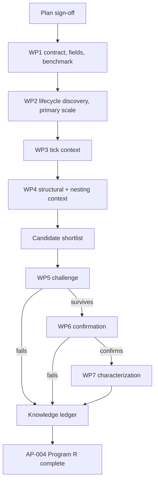

# AP-004 Order Blocks Program R research plan — V3

**Status:** Draft for sign-off
**Project:** AP-004 Order Blocks, XAUUSD
**Boundary:** Program R only. No strategy or portfolio research.
**Authority:** Frozen
**Confirmation data:** Locked until the confirmation phase
**Execution rule:** No research run starts until this plan is approved.

## 1. Objective and definition of done

`order_blocks` is a LIFECYCLE_OBJECT, the same broad role as `fvg`, but it is not the same object and this plan does not copy AP-002's design onto it. `fvg` forms from a three-bar imbalance; `order_blocks` forms from a different producer criterion (displacement following an origin candle). Whatever that criterion is exactly, it is `UNRESOLVED` in the registry, so this plan defines the zone-object lifecycle in general terms and requires WP1 to bind it to the actual frozen fields.

The project determines what an order-block zone tells us, across its life from formation to termination, about four things:

1. what happens to the zone itself (does it get touched, how, and how it ends);
2. what price does on the zone's native-bar clock around each lifecycle anchor;
3. what price and microstructure do on a bounded tick-time clock immediately after `FORMED`, `FIRST_TOUCH`, and any lawfully observed terminal event;
4. what the surrounding detector system does around each anchor, including whether information transfers from bar structure into a later tick-scale trigger, and whether the zone adds information beyond that context.

For each zone, the study must answer:

1. What is the zone's direction, native scale, and formation context?
2. How long until first touch, and how long from first touch to an observed market terminal state?
3. Does the zone end mitigated or invalidated, or remain right-censored at the DEVELOPMENT boundary?
4. What does price do on the native-bar clock after `FORMED`, `FIRST_TOUCH`, and any lawful observed terminal event?
5. What happens during the immediate tick-scale microreaction after each lawful lifecycle anchor becomes knowable?
6. Which tick-detector states emerge or change during that microreaction, and do they separate materially different zone outcomes?
7. What did structural context (other zones, swings, liquidity, cross-scale order blocks) look like at formation, and how did it evolve after?
8. Does an order block add information beyond the structural and tick context already known at each anchor?
9. Which findings survive untouched chronological confirmation?

AP-004 Program R is complete only when formation discovery, tick conditioning, structural conditioning, incremental-information testing, challenge, confirmation, and characterization are finished, and every major claim ends as `CONFIRMED`, `REJECTED`, `NULL`, or `INCONCLUSIVE`. A table of formation/touch/mitigation rates is not completion by itself; it becomes completion only once paired with the context and control work in Sections 8 through 10.

## 2. Scope control

### Included

Field enumeration, primary-scale selection, zone-lifecycle reconstruction (formation, first touch, mitigation, invalidation, censoring), forward and antecedent measurement at each anchor, tick context, structural and cross-scale context including nesting with other zone objects, matched controls, challenge, untouched confirmation, characterization.

### Excluded

Strategy optimization, entries, exits, sizing, transaction-cost search, portfolio construction, redesign of the `order_blocks` detector itself, and treating this plan's FVG-adjacent shape as license to skip the field-enumeration and control work FVG already went through separately.

### Change rule

Unchanged from AP-001 and AP-003: new ideas go to the backlog unless the active work package requires them; defects get the smallest repair; scope changes state reason, schedule impact, and affected deliverable before approval.

## 3. Detector role and scientific unit

Role: `LIFECYCLE_OBJECT`. One scientific unit is one lawful order-block zone instance, tracked from its first observed formation event through its terminal state. A zone that was already open at the start of the observed corpus (no formation event seen) is a separate, left-truncated population, not folded into the formation-anchored cohort.

Lifecycle vocabulary for this study (general zone terms, pending WP1 confirmation of the exact frozen labels):

**Market lifecycle**

`FORMED -> FIRST_TOUCH -> {MITIGATED | INVALIDATED}`

A zone may also move directly from `FORMED` to a producer-defined terminal market state if the frozen semantics permit that path; WP1 must bind the exact producer transitions.

**Observation status**

- `OBSERVED_TERMINAL`
- `RIGHT_CENSORED_UNTOUCHED`
- `RIGHT_CENSORED_TOUCHED`

`CENSORED` is not a market lifecycle state and is never treated as something the order block did. It records that the DEVELOPMENT observation window ended before a market terminal state was observed.

Partial-interaction states (partial fill, retest without fill) are retained as intermediate events on the same zone's timeline, not treated as separate zones.

## 4. Frozen inputs and causal rules

### Data identities

| File | Git blob | Bytes | SHA256 of pushed content |
| --- | --- | ---: | --- |
| `instruments/XAUUSD/lake/manifest.json` | `7388e08d61b1c456094e1cd378f33535f752deb8` | 1,893,861 | `1176d6518c83ff1b5ec27b03df416c11d146b9611fb307398193c5cb9b5053af` |
| `instruments/XAUUSD/lake/payload_manifest.json` | `ad4cdaef1c987c3ab58d4375e65232eb3fe4c470` | 2,342,922 | `78d5fc20758831e06d487217d0367bbaab5f25cb7eefcac8bee9446f6eea3eed` |

Same corpus as AP-001 and AP-003. WP1 verifies these identities first.

### Causal clock

Bar surface, seven native scales. Native bar timestamps and research availability must not be assumed to be identical.

- `bar_close_ts` defines native bar-close provenance.
- `bar_open_ts` is provenance only.
- WP1 must bind formation, touch, mitigation, and invalidation to the actual lawful availability coordinate in the frozen producer/replay semantics.
- If `bar_close_ts` is proven to be the lawful availability coordinate for a given event, use it directly.
- If the event only becomes knowable on receipt of a boundary-crossing tick, use the verified receipt/sidecar availability coordinate.
- Cross-scale joins use each scale's own verified availability coordinate.

No behavioral artifact may be produced until WP1 records the verified availability rule for every lifecycle event used as an anchor.

### Payload field gap

WP1 enumerates the actual `payload_order_blocks` fields (direction, any partial-mitigation marker, any confirmation-strength field) before the measurement design in Section 7 is finalized in code. This plan fixes the research shape; it does not assume field names it has not verified.

## 5. Left- and right-boundary policy, and primary-scale selection

### Left boundary

Zones open at the start of the observed window without an observed formation event are flagged `LEFT_TRUNCATED_FORMATION` and excluded from the formation-anchored cohort. They remain eligible for a touch/mitigation-only analysis that does not require a known formation time.

### Right boundary

Zones still open (not mitigated, not invalidated) at the DEVELOPMENT boundary (`2026-05-05T12:39:00Z`) are retained as right-censored observations, not dropped and not counted as failures.

They are classified as `RIGHT_CENSORED_UNTOUCHED` or `RIGHT_CENSORED_TOUCHED` according to their last lawfully observed lifecycle state. Censoring is an observation status, not a terminal market event.

### Primary-scale selection rule

Same rule and same reasoning as AP-003, applied independently to `order_blocks`' own counts:

> The primary phenotype scale is the coarsest native scale whose development-window formation-event count meets or exceeds 300. 300 is the frozen minimum for stable p05/p95 tail estimates in this program. If no scale reaches 300, fall back to 150 and mark excluded scales `INSUFFICIENT_SUPPORT`.

The other six scales become cross-scale nesting context (Section 8), not parallel primary studies.

## 6. Measurement clocks

### Anchors

`FORMED` and `FIRST_TOUCH` are primary lifecycle anchors because formation context and touch context are different pieces of information and must not be pooled.

Observed market terminal events (`MITIGATED` and `INVALIDATED`, subject to WP1's exact frozen vocabulary) may be used as terminal-event anchors for post-terminal characterization when lawful DEVELOPMENT future remains available.

Right-censor statuses are never anchors. They have no post-boundary DEVELOPMENT future and exist only to preserve incomplete lifecycle observations.

### Forward horizons at `FORMED` and `FIRST_TOUCH` (native-bar count)

| Horizon | Reason |
| --- | --- |
| `+1 bar` | Immediate reaction. |
| `+2 bars` | Same-cycle confirmation window. |
| `+3 bars` | Short continuation window. |
| `+5 bars` | Medium continuation window. |
| `+10 bars` | Persistence beyond immediate reaction. |

At every horizon: endpoint return, direction-adjusted return, MFE and MAE with timing, whether MFE precedes MAE, realized volatility, missingness when the window is censored. Store raw, normalized, and normalization basis.

### Cross-resolution bridge: bar lifecycle anchor -> tick outcome

The native-bar count remains the **primary lifecycle and structural research horizon**. A second, bounded tick-time outcome clock is mandatory at the primary discovery scale because a bar-defined zone event can create short-lived microstructure information that is invisible in completed-bar summaries.

The bridge begins at the lifecycle anchor's **verified lawful availability time**.

#### Native-bar outcome clock

Unchanged:

- `+1 bar`
- `+2 bars`
- `+3 bars`
- `+5 bars`
- `+10 bars`

These horizons answer whether the zone anchor carries information over its native structural scale.

#### Tick microreaction clock

At `FORMED` and `FIRST_TOUCH`, and at a lawfully observed `MITIGATED` or `INVALIDATED` terminal event when DEVELOPMENT future remains available, use:

- `+5s`
- `+15s`
- `+30s`
- `+60s`

At each tick horizon, record:

- raw and direction-adjusted return;
- tick-resolved MFE and MAE;
- time to MFE and MAE;
- which excursion occurs first;
- initial favorable and adverse excursion;
- path efficiency;
- realized tick volatility;
- spread state and change;
- quote-arrival state and change;
- quote-dynamics state and change;
- quote-pressure alignment/opposition and change;
- micro-volatility state and change;
- Drift-Burst state at the anchor and any lawful post-anchor state transition.

Right-censored observation statuses are never anchors and therefore have no post-boundary microreaction window.

The native-bar and tick microreaction results are reported separately. A zone can carry short-lived tick information without producing meaningful multi-bar continuation, or the reverse.

#### Intrabar ordering fallback

If tick resolution is unavailable for a specific artifact, retain:

- bar-index MFE and MAE;
- bar-index timing;
- endpoint and normalized return;
- `ORDER_UNKNOWN_SAME_BAR` when both extrema occur inside the same native bar and bar data cannot establish their order.

#### Prospective re-anchor rule

A tick state that emerges after `FORMED` or `FIRST_TOUCH` is an outcome of that zone anchor.

Example:

`FIRST_TOUCH -> quote-pressure alignment -> Drift-Burst ONLINE -> short price excursion`

The Order-Block study may discover and characterize that sequence, but it cannot pretend the later pressure or Drift-Burst state was available at `FIRST_TOUCH`.

If a later tick state repeatedly precedes a material outcome, create a separate prospective bridge test anchored when that tick event/state becomes lawful, with the order block retained as already-known structural context.

This is the valid path from a bar-defined zone lifecycle into a possible tick-triggered information candidate.

### Lifecycle-clock measures (not fixed horizons)

Time to first touch (bars, from formation), time from first touch to observed market terminal state (bars), market terminal-state distribution (mitigated / invalidated, subject to WP1's exact vocabulary), and separate right-censor fractions (`RIGHT_CENSORED_UNTOUCHED`, `RIGHT_CENSORED_TOUCHED`). These are computed fresh against `order_blocks`' own frozen fields and are not inherited from FVG's numbers.

### Antecedent windows (native-bar count)

`-1, -3, -5, -10` bars before `FORMED`, to characterize the pre-formation displacement and volume regime. Antecedent evidence is discovery only, per the same prospective re-anchor rule as every other AP-series plan.

## 7. What the study measures

At `FORMED`: direction, native scale, distance from prior swing/pivot (normalized via `vwma_atr`), and same-timestamp state of `swings`, `bos_choch`, `local_structure` (was the zone formed at or near a structural break).

At `FIRST_TOUCH`: bars since formation, whether the touch is a wick-only interaction or a close-through interaction (once WP1 confirms the field exists), and same-timestamp tick context.

At an observed market terminal state: bars since first touch, terminal type, and whether termination coincides with a `bos_choch` event or a cross-scale order-block interaction. Right-censored zones are reported separately and are not assigned a terminal type.

Cross-scale nesting, recorded but not a primary population until support is checked:

- is a primary-scale zone nested inside, overlapping, or independent of a coarser-scale zone;
- does a finer-scale zone's mitigation tend to precede or follow the coarser-scale zone's first touch;
- does overlap with an `fvg` or `range` object at the same location change the outcome (a direct test of whether zone objects are redundant with each other, required by Rule 11).

## 8. Same-domain tick context, co-evolution, and cross-resolution bridge

The tick-family design is re-pointed to `FORMED`, `FIRST_TOUCH`, and any lawful observed terminal-event anchor instead of a Drift-Burst state or a `bos_choch` event.

At-anchor tick context asks what was already known when the lifecycle event became available. Post-anchor tick evolution asks what microstructure state emerges afterward inside the bounded `+5/+15/+30/+60s` bridge and later inside the native-bar horizon.

| Context | Role | At-anchor measurements | Post-anchor evolution |
| --- | --- | --- | --- |
| `micro_volatility` | volatility state | level, regime, pre-anchor change | regime transition, expansion/contraction timing |
| `quote_arrival` | market activity | rate, acceleration, persistence | acceleration/deceleration, persistence |
| `quote_dynamics` | repricing behavior | direction, efficiency, change | repricing transition, reversal timing |
| `quote_pressure` | directional microstructure | level, alignment with zone direction | alignment change, persistence, reversal timing |
| `spread_state` | trading condition | level, widening/tightening | widening/tightening transitions |
| `feed_health` | data-quality control | validity only | degradation/recovery status only; anchors inside degraded windows are flagged |

The key cross-resolution question is whether an order-block lifecycle event transfers information into a repeatable tick-scale state before the later bar-scale lifecycle or price outcome becomes visible.

A post-anchor tick transition remains outcome evidence until it is prospectively re-anchored at its own lawful time.

## 9. Structural context and cross-scale co-evolution

At `FORMED`: is the zone forming inside, outside, or overlapping an active `fvg`, `range`, or `dealing_range`; distance to nearest lawful liquidity; recent `bos_choch` proximity; session and volume state; normalization basis.

At `FIRST_TOUCH` and observed market terminal states: does an overlapping zone from another family get touched or invalidated around the same time; does liquidity nearby get interacted with; how long does that take in native bars. Right-censored observations contribute only information lawfully observed before the boundary.

**A. Context at formation.** Does formation at a known structural break or inside an existing zone behave differently from an isolated formation?

**B. Structural evolution after formation and after first touch.** What does the surrounding structure do next, and when?

**C. Joint sequencing.**

`formation -> tick microreaction -> tick-detector transitions -> native-bar price movement -> first touch -> tick microreaction -> structural transitions -> observed market terminal event -> later price movement`

Record order and latency, not causation.

Use this sequence to distinguish:

- **information persistence** — the order-block anchor remains informative on its own native-bar clock;
- **information transfer** — information originating at a zone anchor becomes visible in another resolution, such as tick pressure or Drift-Burst, before a later zone or price outcome.

A recurring post-anchor tick or structural sequence, such as a specific microstructure pattern that repeatedly precedes mitigation, becomes a prospective re-anchor candidate rather than a retroactive predictor.

## 10. Incremental-information controls

**Control A.** Same anchor (`FORMED` or `FIRST_TOUCH`), different structural context: at a known break versus away from one, matched on session, direction, volatility regime, spread state.

**Control B.** Same structural context, with and without an order block present: a known break with and without a nearby order block. Tests whether the zone adds information beyond the structure alone.

**Control C.** Overlapping-zone-family comparison: order blocks that overlap an `fvg` versus order blocks that do not, matched on direction and scale. Tests redundancy between zone-object families directly, per Rule 11.

## 11. Evidence levels and decision relevance

Same six-level model and same decision-relevance tag set as AP-001 and AP-003. Program R stops at L4 plus characterization.

## 12. Work breakdown structure

| WP | Purpose | Required output | Exit condition |
| --- | --- | --- | --- |
| **WP1 Contract, field enumeration, benchmark** | Verify identities; enumerate `payload_order_blocks` fields; measure per-scale formation counts and scan cost. | Verified identities, field list, per-scale count table, primary-scale decision, rows/s, ETA. | Primary scale selected by Section 5 rule; causal ordering and formation reconstruction pass. |
| **WP2 Lifecycle discovery** | Produce the first complete formation/touch/termination result at the primary scale on both native-bar and bounded tick microreaction clocks. | Time-to-touch and touch-to-observed-terminal distributions, separate market-terminal and right-censor summaries, native-bar price paths, `+5/+15/+30/+60s` microreaction price paths at lawful anchors, readable E1 report. | Every lawful anchor and observed terminal class has both a native-bar result and a microreaction result, or `INSUFFICIENT_SUPPORT`; censored populations are reported separately. |
| **WP3 Tick conditioning, co-evolution, and bridge discovery** | Determine how tick context changes each anchor's outcome, how the tick system evolves after, and whether a repeatable bar->tick information-transfer sequence exists. | Conditional tables, post-anchor tick-transition tables, bridge sequence table, event-order/latency summaries, prospective re-anchor candidates. | Every tick family ends with a result or an explicit null/insufficient-support/quality-excluded status; every promoted post-anchor tick pattern is labeled retrospective or prospectively re-anchored. |
| **WP4 Structural conditioning and nesting** | Determine how zone/liquidity context, structural breaks, and cross-scale/cross-family nesting change the outcome. | Structural-context tables, nesting-overlap tables, joint sequencing summaries, lineage notes (Rule 11 vs `fvg`/`range`), candidate list. | The report states which contexts and overlaps matter and which lack support. |
| **WP5 Candidate challenge** | Try to destroy promoted findings; test incremental information against zone-family redundancy. | Matched controls, block-aware nulls, multiplicity-adjusted results. | Each candidate is `SURVIVED_CHALLENGE`, `REJECTED`, `NULL`, or `INCONCLUSIVE`. |
| **WP6 Confirmation** | Test frozen survivors on untouched data. | One frozen confirmation result per survivor. | Each is `CONFIRMED`, `FAILED_CONFIRMATION`, or `INCONCLUSIVE_CONFIRMATION`. |
| **WP7 Characterization, supported-scale replication, and closure** | Explain confirmed information and negative knowledge; classify the detector's native and cross-resolution information domains; test whether primary-scale conclusions port to every other supported scale. | Final report, knowledge ledger, decision-relevance matrix, supported-scale replication/heterogeneity table, information-persistence/transfer summary. | Definition of done is satisfied; no supported native scale remains unclassified; confirmed findings state whether information is native-bar, tick-microreaction, cross-resolution, or absent. |

## 13. Discovery, challenge, and confirmation rules

Same separation as AP-001 and AP-003. WP2 through WP4 are discovery, cheap and broad. WP2 freezes support and noise reference before WP3/WP4 open. Promotion into WP5 requires support at or above the frozen 300/150 minimum, chronological breadth, no single day or session dominating, material magnitude, stable direction, an understandable information path, and a clean Rule 11 lineage check against `fvg` and `range`. WP5 uses Holm control at 0.05 for primary hypotheses and BH-FDR at 0.05 for discovery-derived families. Only `SURVIVED_CHALLENGE` candidates reach WP6, opened once, fully frozen before access.

## 14. Resource plan

Unchanged: Rust toolsmith/executor, research analyst, independent skeptic (WP5 and confirmation review), research director. Default concurrency two; a third only for independent work with no shared mutable evidence.

## 15. Schedule and progress control

| Work package | Optimistic | Most likely | Pessimistic |
| --- | ---: | ---: | ---: |
| WP1 | 0.75 h | 1.25 h | 2 h |
| WP2 | 2 h | 3 h | 5 h |
| WP3 | 1.5 h | 2.5 h | 4 h |
| WP4 | 2 h | 3.5 h | 6 h |
| WP5 | 1.5 h | 3 h | 5 h |
| WP6 | 1 h | 1.5 h | 2.5 h |
| WP7 | 1.5 h | 2.5 h | 4 h |

PERT gives an initial forecast of about **19 active work-hours**, slightly above AP-001 and AP-003 because WP2 carries two anchors (`FORMED`, `FIRST_TOUCH`) plus a terminal-state split instead of one. This is a forecast, not a promise. Reforecast only if measured runtime or a validity defect changes the total by more than 25 percent. A work package that reaches its pessimistic estimate without meeting its exit condition stops and gets a change decision, not continued effort.

Progress is measured by completed scientific deliverables (primary-scale selection, lifecycle discovery, tick conditioning, structural conditioning, challenged candidates, confirmation, final knowledge). Infrastructure-only work does not count unless it repairs a documented validity defect.

## 16. Risk register

| Risk | Control | Contingency |
| --- | --- | --- |
| unverified payload fields | WP1 enumerates actual fields before design commits further | drop assumed measurements that turn out not to exist |
| primary-scale mis-selection | frozen rule in Section 5 | reselect only through a change decision |
| pooling formation and touch context | `FORMED` and `FIRST_TOUCH` measured and reported as separate anchors | reject any table that merges them |
| future information leakage | availability by `bar_close_ts` only | reject affected evidence, repair the join |
| left-truncated open zones | `LEFT_TRUNCATED_FORMATION` flag, separate population | exclude from formation-anchored cohort only |
| right censoring mistaken for lifecycle termination | separate `RIGHT_CENSORED_UNTOUCHED` / `RIGHT_CENSORED_TOUCHED` observation status from market terminal states | reject any table that treats censoring as mitigation, invalidation, or a terminal-event anchor |
| zone-family redundancy (`fvg`, `range`, `order_blocks` overlap) | Rule 11 dependency check, Control C in Section 10 | collapse dependent context into one information family |
| search explosion across seven scales and multiple zone families | one primary scale first, others as nesting context only | register cross-family ideas for later work, not parallel studies |
| cross-resolution search explosion | fixed `+5/+15/+30/+60s` bridge only at the primary discovery scale; expensive challenge only for promoted relationships | do not add arbitrary wall-clock grids or cross every tick field with every zone field |
| post-anchor tick-state leakage | later tick transitions are outcomes until prospectively re-anchored | reject any claim that treats a post-anchor tick state as known at `FORMED` or `FIRST_TOUCH` |
| low-support interactions | frozen 300/150 minimum, distinct-period requirement | mark `INSUFFICIENT_SUPPORT` |
| AI over-interpretation | every claim links to deterministic evidence | skeptic downgrades unsupported wording |
| confirmation contamination | locked custody | invalidate confirmation status if breached |
| infrastructure creep | scope and defect rules | backlog unrelated engineering |

## 17. Project controls

Four records only: this plan, one work-package status file, one decision log, the risk register. Same phase-gate and defect procedure as AP-001 and AP-003.

## 18. Final deliverables

- `AP-004_FINAL_RESEARCH_REPORT.md`
- `AP-004_KNOWLEDGE_LEDGER.json`
- `AP-004_DECISION_RELEVANCE_MATRIX.md`
- one decision log linking final claims to evidence

The final report must explain: which native scale was selected and why; time-to-touch and touch-to-termination behavior; the terminal-state split and what predicts each outcome; what happens on the native-bar clock; what happens on the bounded tick microreaction clock after each lawful lifecycle anchor; whether information persists within one resolution or transfers from the bar-defined zone into a later tick-scale state; which tick and structural conditions change formation and touch behavior; which cross-scale and cross-family nesting patterns recur; which post-anchor tick observations were prospectively re-anchored; whether `order_blocks` adds information beyond context and beyond overlapping zone families; which findings survived challenge and confirmation; which conditions make confirmed findings weaken; what later strategy research may investigate; which studies produced null, rejected, or inconclusive results.

## 19. Sign-off

- [ ] zone-lifecycle definition and scientific unit
- [ ] causal availability rule verified against producer/replay semantics
- [ ] field-enumeration rule
- [ ] left/right boundary policy
- [ ] censoring separated from market lifecycle state
- [ ] primary-scale selection rule
- [ ] supported-scale phenotype-replication / heterogeneity rule
- [ ] anchor separation between `FORMED`, `FIRST_TOUCH`, and observed market terminal events
- [ ] right-censor statuses prohibited as anchors
- [ ] native-bar forward and antecedent horizons and their reasons
- [ ] bounded `+5/+15/+30/+60s` bar->tick microreaction bridge
- [ ] tick path-resolution rule and `ORDER_UNKNOWN_SAME_BAR` handling
- [ ] post-anchor tick-state prospective re-anchor rule
- [ ] information-persistence versus information-transfer distinction
- [ ] tick-context design and co-evolution
- [ ] structural and cross-scale/cross-family context design and co-evolution
- [ ] joint price/detector sequencing rule
- [ ] incremental-information controls, including zone-family redundancy check
- [ ] evidence levels and decision-relevance tags
- [ ] seven work packages
- [ ] discovery, challenge, confirmation separation
- [ ] resource plan
- [ ] risk controls
- [ ] schedule and reforecast rule
- [ ] strategy and portfolio exclusion

**Decision:** `APPROVED`, `REWORK`, or `REJECTED`.

This plan was produced using the Detector Research Planning skill and the Research Project Execution skill already committed to this repository. It does not amend AP-001, AP-002, or AP-003; it is its own frozen contract, and it deliberately does not reuse AP-002's FVG design beyond the shared role category.
