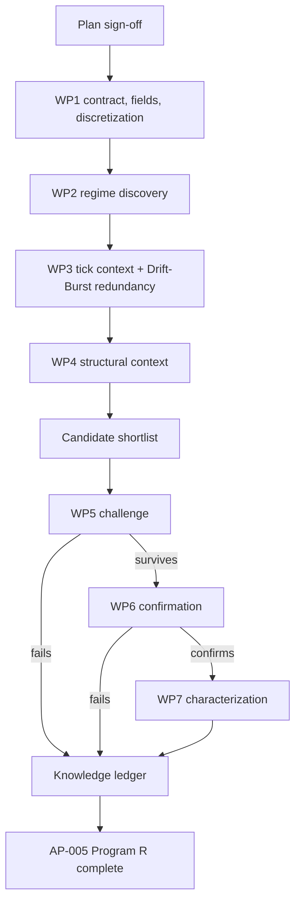

# AP-005 Quote Pressure Program R research plan — V2

**Status:** Draft for sign-off
**Project:** AP-005 Quote Pressure, XAUUSD
**Boundary:** Program R only. No strategy or portfolio research.
**Authority:** Frozen
**Confirmation data:** Locked until the confirmation phase
**Execution rule:** No research run starts until this plan is approved.

## 1. Objective and definition of done

AP-001 used `quote_pressure` only as same-domain context for Drift-Burst: alignment, opposition, persistence, recorded at the Drift-Burst anchor and followed afterward as evolution. This project switches the anchor. `quote_pressure` becomes the center; Drift-Burst and every other detector become the context observed around it.

This is not redundant with AP-001. AP-001 tells us what the market and detector system look like around Drift-Burst states. It does not tell us what the market and detector system look like around a `quote_pressure` regime change that occurs without a Drift-Burst state present, nor whether `quote_pressure` regime changes carry information on their own once Drift-Burst's own contribution is controlled for.

The project determines, for each `quote_pressure` regime entry:

1. What usually happens next inside `quote_pressure` itself (does the regime hold, strengthen, or reverse)?
2. What does price do on the native tick-time clock after the regime becomes knowable?
3. Does information originating in the tick regime persist into later bar-scale price or structural behavior?
4. What do the other tick detectors, and Drift-Burst specifically, do at and after the same moment?
5. Which structural context, already known at that moment, changes the tick-time or bar-time outcome?
6. Which bar and structural detector events emerge after the tick anchor, and in what order relative to price and tick-detector transitions?
7. Does `quote_pressure` add information beyond Drift-Burst's own state, once both are observed at the same moment (a direct redundancy test, not an assumption)?
8. Which findings survive untouched chronological confirmation?

AP-005 Program R is complete only when regime discovery, native tick-time market behavior, the bounded tick->bar resolution bridge, cross-tick-detector conditioning (with an explicit Drift-Burst redundancy test), structural conditioning and co-evolution, incremental-information testing, challenge, confirmation, and characterization are finished, and every major claim ends as `CONFIRMED`, `REJECTED`, `NULL`, or `INCONCLUSIVE`.

## 2. Scope control

### Included

Regime definition and discretization (Section 5), field enumeration, regime-entry discovery, native tick-time forward market-path measurement, bounded tick->bar outcome measurement, cross-tick-detector context and co-evolution including an explicit Drift-Burst overlap test, structural context and post-anchor structural evolution, matched controls, challenge, untouched confirmation, characterization.

### Excluded

Strategy optimization, entries, exits, sizing, transaction-cost search, portfolio construction, redesign of `quote_pressure` itself, and treating this project as a reason to reopen or amend AP-001's frozen Drift-Burst design.

### Change rule

Unchanged: new ideas go to the backlog unless the active work package requires them; defects get the smallest repair; scope changes state reason, schedule impact, and affected deliverable before approval. Per the Research Project Execution skill's cross-project rule, nothing here amends AP-001 by implication.

## 3. Detector role and scientific unit

Role: `DIRECTIONAL_CONTEXT` with `STATE_REGIME` behavior once discretized. One scientific unit is one lawful first-entry into a defined `quote_pressure` regime, on the tick surface.

`quote_pressure` in AP-001 was described only by continuous-sounding attributes (level, alignment, opposition, persistence). The registry marks it `UNRESOLVED`, so this plan does not assume discrete states exist in the frozen payload. Section 5 fixes this before any measurement is built.

## 4. Frozen inputs and causal rules

### Data identities

| File | Git blob | Bytes | SHA256 of pushed content |
| --- | --- | ---: | --- |
| `instruments/XAUUSD/lake/manifest.json` | `7388e08d61b1c456094e1cd378f33535f752deb8` | 1,893,861 | `1176d6518c83ff1b5ec27b03df416c11d146b9611fb307398193c5cb9b5053af` |
| `instruments/XAUUSD/lake/payload_manifest.json` | `ad4cdaef1c987c3ab58d4375e65232eb3fe4c470` | 2,342,922 | `78d5fc20758831e06d487217d0367bbaab5f25cb7eefcac8bee9446f6eea3eed` |

Same corpus as AP-001, AP-003, AP-004. WP1 verifies these identities first.

### Causal clock

Tick surface, same rule as AP-001: `received_ts_ns` is the availability clock, `source_sequence` breaks ties, `event_ts_ns` is provenance only. Later completion fields never define earlier cohorts.

### Payload field gap and discretization requirement

WP1 enumerates the actual `payload_quote_pressure` fields. If the payload exposes discrete regime labels already, those labels become the anchors directly. If it exposes only a continuous score, WP1 must define a discretization rule (for example, development-window terciles or a fixed-threshold rule justified by the score's own distribution) before any anchor is defined, and that rule is frozen as part of this contract, not chosen after seeing outcomes. This plan does not pre-guess which case applies.

## 5. Left- and right-boundary policy

### Left boundary

The first regime entry observed in the corpus may lack a known prior regime (no observed transition into it). These entries are flagged `LEFT_TRUNCATED_REGIME` and retained for occupancy and forward-path analysis, but excluded from transition-matrix analysis that requires a known prior state.

### Right boundary

Regime episodes still open at the DEVELOPMENT boundary are retained with explicit `RIGHT_CENSORED_REGIME` observation status.

Censoring is not a `quote_pressure` regime and is never used as an anchor. It records only that the observation window ended before the regime's next transition or exit was observed.

### No primary-scale selection needed

Unlike AP-003 and AP-004, `quote_pressure` has one native scale (tick), so there is no cross-scale selection problem. The open question this plan does carry, instead, is the discretization rule above, and it is resolved the same way: predeclared, not chosen after the fact.

## 6. Measurement clocks and cross-resolution bridge

The detector's native anchor is tick-based, but the research outcome is not restricted to tick time. AP-005 uses two prospective clocks that answer different questions.

### A. Native tick-time horizons

This plan reuses AP-001's forward-horizon set:

- `+5s`
- `+15s`
- `+30s`
- `+60s`
- `+120s`
- `+300s`

This is a cross-study comparability choice, not an assumption that `quote_pressure` has the same internal multiscale computation as Drift-Burst. WP1 independently checks whether `payload_quote_pressure` exposes its own internal multiscale sub-measurements. If it does, they become anchor-time attributes; if not, the final report states that explicitly.

At every tick horizon record:

- endpoint return;
- direction-adjusted return;
- MFE and MAE with timing;
- continuation and reversal distance;
- realized volatility;
- path efficiency;
- missingness when the lawful DEVELOPMENT window ends before the horizon.

Store raw values, normalized values, and normalization basis.

### B. Tick -> bar outcome bridge

A tick-defined pressure regime may contain information whose main expression is not visible within the first 300 seconds. The project therefore follows every lawful regime-entry anchor into the bar surface without changing the original anchor time.

Bridge scales:

- `15s`
- `30s`
- `1m`
- `5m`
- `15m`
- `1h`
- `4h`

At each scale use the first lawful native bar available after the tick anchor and measure:

- `+1 bar`
- `+2 bars`
- `+3 bars`
- `+5 bars`

The bar bridge is descriptive discovery first. It does not create seven separate full research programs.

At every bridge horizon record:

- raw and pressure-direction-adjusted bar return;
- bar MFE and MAE;
- realized volatility;
- whether the bar-scale path is directionally consistent with the tick-time path;
- first lawful `bos_choch` event and latency where present;
- first relevant `fvg`, `range`, `order_blocks`, liquidity, or local-structure transition and latency where present;
- censor status.

The bridge asks whether information **persists** from the tick regime into later bar behavior or **transfers** into a structural transition that was not yet visible at the original tick anchor.

### C. Prospective re-anchor rule

Any structural event that occurs after the `quote_pressure` anchor is an outcome of the original anchor.

Example:

`quote_pressure regime entry -> Drift-Burst transition -> 5m BOS -> later continuation`

AP-005 may discover and characterize this ordered sequence. It may not treat the later BOS as information that was known at the original pressure anchor.

If a later bar event repeatedly appears before a material outcome, the later event must be prospectively re-anchored at its own lawful availability time, with the earlier `quote_pressure` regime retained only as already-known context.

### D. Antecedent windows

Use:

- `-5s`
- `-15s`
- `-30s`
- `-60s`

These characterize what changed before the regime entry. Antecedent evidence is discovery only and is subject to the same prospective re-anchor rule.

## 7. What the study measures

At each regime entry: regime label (or discretized bucket, per Section 5), score/intensity if continuous, prior regime, dwell time in the prior regime, and any internal multiscale attributes WP1 confirms exist.

Internal research questions:

1. How often does each regime hold, strengthen, or reverse?
2. Which transition paths dominate the regime's own transition matrix?
3. How long does each regime persist, and does persistence itself predict the forward path?
4. Is a strong-pressure regime a stronger version of a weak-pressure regime, or a different population?

## 8. Same-domain tick context and co-evolution, with an explicit Drift-Burst redundancy test

At every `quote_pressure` regime entry, snapshot the other five tick families and follow their evolution, using the same role table as AP-001.

| Context | Role | At-anchor measurements | Post-anchor evolution |
| --- | --- | --- | --- |
| `micro_volatility` | volatility state | level, regime, pre-anchor change | regime transition, expansion/contraction timing |
| `quote_arrival` | market activity | rate, acceleration, persistence | acceleration/deceleration, persistence |
| `quote_dynamics` | repricing behavior | direction, efficiency, change | repricing transition, reversal timing |
| `spread_state` | trading condition | level, widening/tightening | widening/tightening transitions |
| `feed_health` | data-quality control | validity only | degradation/recovery status only; anchors inside degraded windows are flagged |
| `drift_burst` | lifecycle/state detector | state at anchor time (`WEAK`/`ONLINE`/`STRONG`/`DECAY_RISK`/`DYING`/none) | Drift-Burst transitions after the anchor |

Drift-Burst gets its own explicit line here, not folded into a generic "other detector" bucket, because Rule 11 requires checking derivation overlap directly: AP-001 already established `quote_pressure` as directional-microstructure context for Drift-Burst. This project must determine whether `quote_pressure` regime changes carry information when Drift-Burst is absent, and whether, when both are present at the same moment, `quote_pressure` still adds anything once Drift-Burst's own state is controlled for. If it does not, the correct conclusion is that `quote_pressure` is fully explained by its role as Drift-Burst context, and that gets reported as a `NULL` incremental-information result, not hidden.

## 9. Structural context and co-evolution

At each regime entry, snapshot the same structural families used in AP-001, AP-003, and AP-004: zone location (`fvg`, `range`, `order_blocks`, `dealing_range`), structural transition state (`swings`, `bos_choch`, `local_structure`), liquidity, volume and session state, normalization basis.

Follow their evolution afterward on the bar bridge in Section 6. Record the first relevant post-anchor structural transition, its native scale, lawful availability time, and latency from the `quote_pressure` anchor.

The joint sequence is:

`quote_pressure anchor -> tick price path -> tick-detector transitions -> bar-scale price path -> structural-detector transition -> later price path`

Record order and latency, not causation.

This separates two forms of information:

- **information persistence** — the pressure regime remains informative as time advances;
- **information transfer** — the tick-defined pressure event becomes associated with a later bar/structural state before the eventual market outcome.

Structural context already known at the anchor may condition the original `quote_pressure` result. Structural events that occur later remain outcomes until they are prospectively re-anchored.

## 10. Incremental-information controls

**Control A.** Same regime, different structural context: matched on session, day, prior volatility regime, spread state.

**Control B.** Same structural context, with and without the regime present. Tests whether `quote_pressure` adds information beyond the structure alone.

**Control C (Drift-Burst redundancy).** Same regime entries split by whether Drift-Burst is in an active state at the same moment versus absent, and, where both are active, matched comparisons controlling for Drift-Burst's own state. This is the control that answers the question this project exists to ask: does `quote_pressure` carry information Drift-Burst does not already carry?

## 11. Evidence levels and decision relevance

Same six-level model as the rest of the program. Program R stops at L4 plus characterization. The Drift-Burst redundancy result (Section 10, Control C) gets its own explicit decision-relevance tag, `NO_DECISION_RELEVANCE_FOUND` if fully redundant, one of the standard candidate tags if not.

## 12. Work breakdown structure

| WP | Purpose | Required output | Exit condition |
| --- | --- | --- | --- |
| **WP1 Contract, field enumeration, benchmark** | Verify identities; enumerate `payload_quote_pressure` fields; freeze discretization rule if needed; measure scan cost. | Verified identities, field list, discretization rule (if needed), regime-entry counts, rows/s, ETA. | Regime definition frozen; causal ordering and first-entry reconstruction pass. |
| **WP2 Regime discovery and resolution bridge** | Produce the first complete `quote_pressure` behavioral result on both the native tick-time clock and the bounded tick->bar bridge. | Transition matrix, dwell/persistence distributions, six tick-horizon market paths, seven-scale `+1/+2/+3/+5 bar` bridge summaries, readable E1 report. | Every regime has a tick-time result and a bar-bridge result, or `INSUFFICIENT_SUPPORT`. |
| **WP3 Cross-tick-detector conditioning, with Drift-Burst redundancy test** | Determine how the other tick detectors, especially Drift-Burst, condition the outcome, and whether `quote_pressure` is redundant with it. | Conditional tables, post-anchor tick-transition tables, Control C redundancy result, event-order/latency summaries. | Every tick family, including the Drift-Burst redundancy question, ends with a result or an explicit null/insufficient-support/quality-excluded status. |
| **WP4 Structural conditioning, co-evolution, and bridge interpretation** | Determine how known bar structure changes the regime outcome, how structural detectors evolve afterward, and whether tick information persists or transfers into later bar behavior. | Structural-context tables, post-anchor structural-transition tables, joint sequencing summaries, information-persistence/transfer table, prospective re-anchor candidates. | The report states which contexts matter, which cross-resolution sequences recur, and which later structural observations remain retrospective versus prospectively re-anchored. |
| **WP5 Candidate challenge** | Try to destroy promoted findings, with particular weight on the Drift-Burst redundancy control. | Matched controls, block-aware nulls, multiplicity-adjusted results. | Each candidate is `SURVIVED_CHALLENGE`, `REJECTED`, `NULL`, or `INCONCLUSIVE`. |
| **WP6 Confirmation** | Test frozen survivors on untouched data. | One frozen confirmation result per survivor. | Each is `CONFIRMED`, `FAILED_CONFIRMATION`, or `INCONCLUSIVE_CONFIRMATION`. |
| **WP7 Characterization and closure** | Explain confirmed information, including the redundancy finding either way, negative knowledge, and the detector's native versus cross-resolution information domain. | Final report, knowledge ledger, decision-relevance matrix, information-persistence/transfer summary. | Definition of done is satisfied and confirmed findings state whether the information is tick-native, bar-persistent, cross-resolution, or absent. |

## 13. Discovery, challenge, and confirmation rules

Same separation as the rest of the program. WP2 through WP4 are discovery. WP2 freezes support and noise reference before WP3/WP4 open. Promotion into WP5 requires the frozen minimum support, chronological breadth, no single day or session dominating, material magnitude, stable direction, an understandable information path, and a clean outcome on the Drift-Burst lineage check. WP5 uses Holm control at 0.05 for primary hypotheses and BH-FDR at 0.05 for discovery-derived families. Only `SURVIVED_CHALLENGE` candidates reach WP6, opened once, fully frozen before access.

## 14. Resource plan

Unchanged: Rust toolsmith/executor, research analyst, independent skeptic (WP5 and confirmation review, and specifically the Drift-Burst redundancy result), research director. Default concurrency two; a third only for independent work with no shared mutable evidence.

## 15. Schedule and progress control

| Work package | Optimistic | Most likely | Pessimistic |
| --- | ---: | ---: | ---: |
| WP1 | 0.5 h | 1 h | 2 h |
| WP2 | 1.5 h | 2.5 h | 4 h |
| WP3 | 2 h | 3.5 h | 5.5 h |
| WP4 | 2 h | 3.5 h | 6 h |
| WP5 | 1.5 h | 3 h | 5 h |
| WP6 | 1 h | 1.5 h | 2.5 h |
| WP7 | 1.5 h | 2.5 h | 4 h |

PERT gives an initial forecast of about **18 active work-hours**. WP3 carries a slightly larger estimate than AP-001's equivalent package because it includes the Drift-Burst redundancy control, which requires a matched-comparison design, not just a descriptive table. This is a forecast, not a promise. Reforecast only if measured runtime or a validity defect changes the total by more than 25 percent. A work package that reaches its pessimistic estimate without meeting its exit condition stops and gets a change decision.

Progress is measured by completed scientific deliverables (regime definition, regime discovery, tick conditioning and redundancy test, structural conditioning, challenged candidates, confirmation, final knowledge). Infrastructure-only work does not count unless it repairs a documented validity defect.

## 16. Risk register

| Risk | Control | Contingency |
| --- | --- | --- |
| undefined regime discretization | WP1 freezes the rule before WP2 begins | if payload is continuous only, apply frozen discretization rule, never a post-hoc bin choice |
| result is fully explained by Drift-Burst | explicit Control C redundancy test in WP3 | report as `NULL` incremental information; still valid Program R knowledge |
| future information leakage | availability by `received_ts_ns`/`source_sequence` only | reject affected evidence, repair the join |
| left-truncated first regime | `LEFT_TRUNCATED_REGIME` flag | exclude from transition-matrix analysis only |
| right censoring | explicit `CENSORED` status | censor-aware analysis where required |
| implicit amendment of AP-001 | cross-project rule from the execution skill | any AP-001 change requires its own decision record, never inherited from this plan |
| lineage duplication with Drift-Burst | Rule 11 check, Control C | collapse into one information family if fully dependent |
| search explosion across six other tick families and structural families | context families bounded to those already defined in AP-001 | register extra ideas for later work |
| cross-resolution search explosion | fixed seven bar scales and `+1/+2/+3/+5` bridge only; challenge only promoted relationships | do not add arbitrary bar horizons or cross every bar detector field with every pressure field |
| future structural-event leakage | post-anchor bar events are outcomes until prospectively re-anchored | reject any claim that treats a later BOS/FVG/range/liquidity event as known at the pressure anchor |
| low-support interactions | frozen support minimum, distinct-period requirement | mark `INSUFFICIENT_SUPPORT` |
| AI over-interpretation | every claim links to deterministic evidence | skeptic downgrades unsupported wording |
| confirmation contamination | locked custody | invalidate confirmation status if breached |
| infrastructure creep | scope and defect rules | backlog unrelated engineering |

## 17. Project controls

Four records only: this plan, one work-package status file, one decision log, the risk register. Same phase-gate and defect procedure as the rest of the program.

## 18. Final deliverables

- `AP-005_FINAL_RESEARCH_REPORT.md`
- `AP-005_KNOWLEDGE_LEDGER.json`
- `AP-005_DECISION_RELEVANCE_MATRIX.md`
- one decision log linking final claims to evidence

The final report must explain: what each `quote_pressure` regime means behaviorally; which internal attributes matter; what happens on the native tick-time clock; what happens on the tick->bar bridge; whether information persists into later bars or transfers into structural events; which other tick conditions and which structural context change that meaning; whether `quote_pressure` adds information beyond Drift-Burst's own state, stated plainly either way; which recurring price/detector sequences were observed; which post-anchor observations were prospectively re-anchored; which findings survived challenge and confirmation; which conditions make confirmed findings weaken; what later strategy research may investigate; which studies produced null, rejected, or inconclusive results.

## 19. Sign-off

- [ ] regime definition and discretization rule (or confirmation none is needed)
- [ ] causal and field-enumeration rule
- [ ] left/right boundary policy
- [ ] six native tick-time horizons and their reasons, and independent check for internal multiscale structure
- [ ] bounded seven-scale `+1/+2/+3/+5 bar` tick->bar bridge
- [ ] information-persistence versus information-transfer distinction
- [ ] prospective re-anchor rule for later bar/structural events
- [ ] tick-context design and co-evolution, including the explicit Drift-Burst line
- [ ] Drift-Burst redundancy control design (Control C)
- [ ] structural-context design and co-evolution
- [ ] joint price/detector sequencing rule
- [ ] incremental-information controls
- [ ] evidence levels and decision-relevance tags
- [ ] seven work packages
- [ ] discovery, challenge, confirmation separation
- [ ] resource plan
- [ ] risk controls
- [ ] schedule and reforecast rule
- [ ] strategy and portfolio exclusion
- [ ] explicit non-amendment of AP-001

**Decision:** `APPROVED`, `REWORK`, or `REJECTED`.

This plan was produced using the Detector Research Planning skill and the Research Project Execution skill already committed to this repository. It does not amend AP-001, AP-002, AP-003, or AP-004; it is its own frozen contract.
