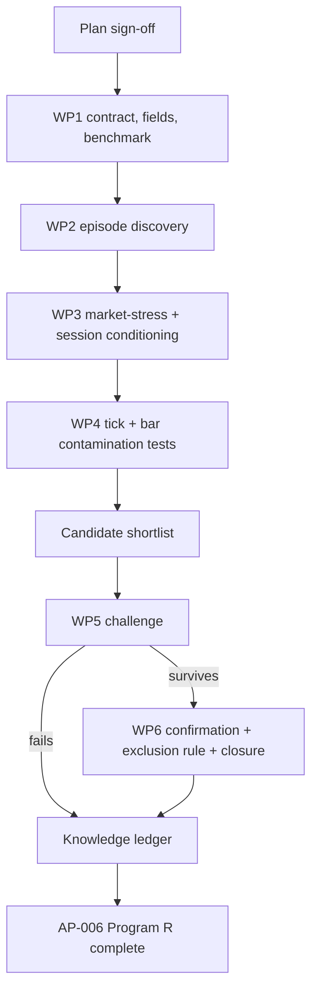

# AP-006 Feed Health Program R research plan — V2

**Status:** Draft for sign-off
**Project:** AP-006 Feed Health, XAUUSD
**Boundary:** Program R only. No strategy or portfolio research.
**Authority:** Frozen
**Confirmation data:** Locked until the confirmation phase
**Execution rule:** No research run starts until this plan is approved.

## 1. Objective and definition of done

`feed_health` is `QUALITY_INSTRUMENTATION`, not a behavioral detector. This plan does not reuse AP-001, AP-003, AP-004, or AP-005's shape just because they share a template header. Those four projects ask what a detector tells us about future market or detector-system behavior. This project asks something different: is the data trustworthy while a given detector's finding is being computed, and if not, what should the rest of Program R do about it.

Every other AP-series plan in this program already lists `feed_health` as a context family with one job: validity and contamination only, degradation and recovery status only. This project is where that job gets studied properly instead of assumed.

The project determines:

1. What producer-defined condition triggers a `feed_health` degradation episode?
2. How long do degradation episodes last, and do they resolve cleanly or flap between healthy and degraded?
3. Under what market conditions do degradation episodes occur: stressed, ordinary, or ambiguous?
4. After controlling for market stress, do detector outputs or measured outcomes computed through degraded intervals differ materially from comparable clean intervals?
5. Does the contamination pattern differ between tick-native research and bar-native research derived from the same underlying feed?
6. What exclusion, flagging, or sensitivity rule should the rest of Program R use?
7. Which findings survive untouched chronological confirmation?

Market stress and feed degradation are not mutually exclusive. A feed anomaly can occur during a genuine volatility event. Unless WP1 finds an independent ground-truth diagnostic in the frozen payload, this project does not claim to prove that an observed price move was "real" or "artifact." It tests whether feed-health degradation is associated with evidence instability after matching on observable market conditions.

AP-006 Program R is complete only when episode discovery, market-stress conditioning, tick-domain contamination testing, bar-domain contamination testing, cross-resolution comparison, challenge, confirmation, and characterization are finished. The deliverable that matters most is not a phenotype table; it is a frozen exclusion/flagging recommendation the other AP-series projects can cite in their own risk registers. This project may never deserve its own strategy. Its value is telling the rest of Program R when evidence may be unreliable.

## 2. Scope control

### Included

Field enumeration, episode discovery (incidence, duration, recovery pattern), market-stress conditioning against `micro_volatility` and `spread_state`, session/time conditioning, one tick-domain contamination test, one bar-domain contamination test, cross-resolution contamination comparison, challenge, untouched confirmation, characterization, and a frozen exclusion/flagging recommendation.

### Excluded

Strategy optimization, entries, exits, sizing, transaction-cost search, portfolio construction, redesign of `feed_health` itself, and retroactively modifying AP-001, AP-003, AP-004, or AP-005's already-frozen designs. If this project's exclusion-rule recommendation implies those projects should re-run excluding degraded windows, that is a separate change decision for each of those projects, not an automatic amendment.

### Change rule

Unchanged: new ideas go to the backlog unless the active work package requires them; defects get the smallest repair; scope changes state reason, schedule impact, and affected deliverable before approval.

## 3. Detector role and scientific unit

Role: `QUALITY_INSTRUMENTATION`. One scientific unit is one lawful first-entry into a degraded or invalid state from a healthy state, on the tick surface. A flapping episode (rapid healthy/degraded/healthy oscillation) is retained as its own pattern, not silently merged into one long episode or split into many independent ones without a predeclared rule for what counts as a new episode versus a continuation.

## 4. Frozen inputs and causal rules

### Data identities

| File | Git blob | Bytes | SHA256 of pushed content |
| --- | --- | ---: | --- |
| `instruments/XAUUSD/lake/manifest.json` | `7388e08d61b1c456094e1cd378f33535f752deb8` | 1,893,861 | `1176d6518c83ff1b5ec27b03df416c11d146b9611fb307398193c5cb9b5053af` |
| `instruments/XAUUSD/lake/payload_manifest.json` | `ad4cdaef1c987c3ab58d4375e65232eb3fe4c470` | 2,342,922 | `78d5fc20758831e06d487217d0367bbaab5f25cb7eefcac8bee9446f6eea3eed` |

Same corpus as every other AP-series project. WP1 verifies these identities first.

### Causal clock

Tick surface, same rule as AP-001 and AP-005: `received_ts_ns` is the availability clock, `source_sequence` breaks ties, `event_ts_ns` is provenance only.

### Payload field gap

WP1 enumerates the actual `payload_feed_health` fields (whatever marks degradation: gap detection, stale timestamp, sequence irregularity, crossed quotes, or something else) before the measurement design is finalized. This plan does not assume which mechanism the producer actually flags.

## 5. Left- and right-boundary policy, and episode-continuation rule

### Left boundary

If the corpus begins mid-episode (feed already degraded at the first tick), that episode is flagged `LEFT_TRUNCATED_EPISODE`.

Because its onset occurred before the observed window, it is excluded from onset-incidence counts and full-duration analysis. It may contribute to degraded-time occupancy and to recovery-from-observed-boundary summaries, with left truncation stated explicitly.

### Right boundary

An episode still degraded at the DEVELOPMENT boundary is retained with `RIGHT_CENSORED_EPISODE` observation status. Censoring is not a feed-health state and is not treated as a recovery or failure event.

### Episode-continuation rule

WP1 first checks whether the frozen producer exposes an explicit episode identity or authoritative transition semantics. If it does, those semantics define episode continuity.

If no authoritative episode identity exists, use a predeclared 5-second healthy-gap debounce: a return to `HEALTHY` for less than 5 seconds before degrading again counts as one continuing flapping episode.

The 5-second rule is an operational state-continuity rule, not an outcome-horizon argument. WP2 reports a predeclared robustness table at 1s / 5s / 15s debounce values to show whether incidence, duration, or flap counts depend materially on this bookkeeping choice. The 5-second rule remains the primary definition and is not re-selected from outcomes.

## 6. Measurement clocks

### Episode-lifecycle measures

Time to recovery (seconds, from degradation onset), flap count within an episode, and total degraded duration. These are event-driven measures, not fixed horizons, because an episode's own length is the primary quantity of interest.

### Forward horizons for the contamination test only

`+5s, +15s, +30s, +60s`, matching AP-001's shortest four horizons. These are used only to compare a detector's forward-path measurements computed on healthy-window anchors against the same measurement computed on degraded-window anchors (Section 9); they are not used to claim `feed_health` itself predicts price.

## 7. What the study measures

At each degradation onset: whichever fields WP1 confirms exist (severity, mechanism flag if present), same-timestamp `micro_volatility` level and regime, and same-timestamp `spread_state`.

Internal research questions:

1. What is the incidence rate of degradation episodes over the observed window?
2. What is the duration distribution, and how much of it is flapping versus a single clean episode?
3. Does degradation cluster by session or time of day (conditioning against `time_context` and `auction_context`)?
4. Does a prior degradation episode predict a shorter or longer next episode?

## 8. Market-stress conditioning, not stress-versus-artifact labeling

The project must not infer data truth from volatility alone. A degraded feed can coincide with a genuine market event, and a calm market can still contain a valid producer-defined feed anomaly.

At each degradation onset, characterize the observable market environment immediately before onset using:

- `micro_volatility`;
- `spread_state`;
- `quote_arrival`;
- session/time context.

Classify the **market context**, not the truth of the underlying price move:

- `DEGRADED_WITH_MARKET_STRESS`;
- `DEGRADED_WITHOUT_MARKET_STRESS`;
- `AMBIGUOUS_MARKET_CONTEXT`.

Separately preserve the producer-defined feed-health mechanism or severity fields WP1 confirms exist.

The key test is conditional:

> after matching on observable market stress, does feed-health degradation still correspond to materially different detector outputs, event incidence, or measured forward behavior?

If yes, the evidence supports a contamination/quality effect beyond ordinary market stress. If no, the correct result may be that the feed-health flag is largely coincident with stressed conditions or has no measurable research impact at the tested resolution.

Without independent external ground truth, this project does not label the underlying market move itself as genuine or fake.

## 9. Cross-resolution contamination tests

A tick-surface quality detector can contaminate both tick-native research and bar-native research derived from the same underlying feed. One bar-domain subject is not enough to support a program-wide exclusion rule.

AP-006 therefore uses two predeclared test subjects.

### A. Tick-domain subject: AP-005 `quote_pressure`

Reuse AP-005's frozen regime-entry population once available.

Compare matched regime entries whose causal input/anchor interval is clean with regime entries exposed to a `feed_health` degraded interval.

Measure whether degradation changes:

- regime-entry incidence;
- regime intensity or payload distributions;
- short-horizon `+5/+15/+30/+60s` market-path measurements;
- transition/persistence behavior.

Match on session, market-stress class, volatility, spread, and other predeclared AP-005 controls so the comparison does not reduce to "volatile periods look different."

### B. Bar-domain subject: AP-003 `bos_choch`

Reuse AP-003's frozen primary-scale event table.

The contamination exposure window is not defined merely by whether the final anchor timestamp falls inside degradation. WP4 binds the exposure window to the causal source interval used to form the event, as far as the frozen producer/dependency evidence makes that interval identifiable.

Compare clean events with degraded-exposed events on:

- event incidence;
- subtype/magnitude distributions where available;
- native-bar forward outcomes;
- AP-003's bounded tick microreaction outcomes.

Match on session, market-stress class, direction, volatility, and spread.

### C. Cross-resolution comparison

The final contamination result must state separately whether evidence instability is:

- `TICK_DOMAIN_ONLY`;
- `BAR_DOMAIN_ONLY`;
- `BOTH_DOMAINS`;
- `NO_MEASURABLE_CONTAMINATION`;
- `INCONCLUSIVE`.

A difference in one domain does not automatically authorize exclusion in the other.

If either AP-005 or AP-003 is not yet at the required frozen prerequisite, the corresponding contamination package blocks and escalates. AP-006 does not privately re-derive another detector's events.

## 10. Incremental-information controls

**Control A.** `DEGRADED_WITH_MARKET_STRESS` versus `DEGRADED_WITHOUT_MARKET_STRESS`, matched on time of day and session, compared on duration, severity, and recovery pattern. This describes whether feed degradation behaves differently under stressed conditions; it does not decide whether the underlying price move was real.

**Control B.** Session-conditioned degradation rate compared against the session's own baseline quote-arrival, volatility, and spread regime, testing whether observed degradation is fully explained by ordinary low-liquidity or high-stress conditions.

**Control C.** AP-005 tick-domain contamination comparison, matched on observable market conditions.

**Control D.** AP-003 bar-domain contamination comparison, matched on observable market conditions.

Controls C and D are the central incremental-information tests for this quality project. Their acceptance rules are frozen before the comparisons run.

## 11. Evidence levels and decision relevance

Same six-level model as the rest of the program, with one addition specific to a quality detector: a confirmed finding here does not receive a strategy-facing decision-relevance tag. Instead it receives one of:

- `EXCLUSION_RULE_CANDIDATE` — recommend exclusion for the tested domain and exposure definition;
- `FLAG_OR_SENSITIVITY_RULE_CANDIDATE` — degradation changes evidence enough to require explicit flagging/sensitivity analysis but not blanket exclusion;
- `NO_EXCLUSION_NEEDED` — degraded windows do not measurably contaminate the tested domain at the frozen support level;
- `INSUFFICIENT_SUPPORT` — not enough degraded-window overlap to test.

Recommendations are domain-specific. A bar-domain result does not silently become a tick-domain rule, or vice versa.

This keeps the earlier planning conversation's point intact: `feed_health` may never deserve its own strategy, and that is fine. Its value is telling the rest of Program R when not to trust itself.

## 12. Work breakdown structure

| WP | Purpose | Required output | Exit condition |
| --- | --- | --- | --- |
| **WP1 Contract and field enumeration** | Verify identities; enumerate `payload_feed_health` fields; measure episode counts and scan cost. | Verified identities, field list, episode-count table, rows/s, ETA. | Causal ordering and first-entry reconstruction pass. |
| **WP2 Episode discovery** | Produce the first complete incidence/duration/recovery result and episode-definition robustness check. | Onset incidence, degraded-time occupancy, duration distribution, flap-count distribution, 1s/5s/15s debounce sensitivity table if needed, readable E1 report. | Episode population has a result or `INSUFFICIENT_SUPPORT`; left/right truncation and episode continuity are resolved. |
| **WP3 Market-stress conditioning and session analysis** | Characterize degraded episodes by observable market environment without labeling the underlying market move as genuine/fake. | Market-context classification table, session-conditioned rate table, Control A and Control B results. | Every market-context class has a result or an explicit null/insufficient-support status. |
| **WP4 Cross-resolution contamination testing** | Run AP-005 tick-domain and AP-003 bar-domain matched comparisons using each subject's frozen artifacts. | Tick-domain contamination result, bar-domain contamination result, cross-resolution classification. | Each domain is `MATERIAL`, `NULL`, or `INCONCLUSIVE`, and the exposure window is documented. |
| **WP5 Candidate challenge** | Formally challenge the domain-specific contamination results and market-stress controls. | Matched controls, block-aware nulls, multiplicity-adjusted results. | Each candidate is `SURVIVED_CHALLENGE`, `REJECTED`, `NULL`, or `INCONCLUSIVE`. |
| **WP6 Confirmation and closure** | Test frozen survivors on untouched data; produce domain-specific exclusion/flagging recommendations and final report. | Frozen confirmation results, final report, knowledge ledger, exclusion/flagging recommendation. | Each candidate is `CONFIRMED`, `FAILED_CONFIRMATION`, or `INCONCLUSIVE_CONFIRMATION`; definition of done satisfied. |

Six work packages, not seven. There is no separate structural-conditioning package because the central question is evidence quality, not `feed_health`'s own predictive relationship to market structure. Cross-resolution work lives in WP4 because tick-native and bar-native contamination must be tested separately before any program-wide recommendation is made. Characterization remains folded into WP6 because the primary deliverable is the confirmed exclusion/flagging recommendation.

## 13. Discovery, challenge, and confirmation rules

WP2 and WP3 are discovery. WP2 freezes the support and noise reference before WP3 opens. WP4's two contamination tests are pre-registered, not discovery: the tick-domain and bar-domain acceptance rules (`MATERIAL`, `NULL`, `INCONCLUSIVE`) are frozen before either comparison runs. Promotion into WP5 requires the frozen support minimum, chronological breadth, no single day or session dominating, and a stated contamination path. WP5 uses Holm control at 0.05 for the primary domain-specific contamination hypotheses and BH-FDR at 0.05 for discovery-derived secondary families. Only `SURVIVED_CHALLENGE` candidates reach WP6, opened once, fully frozen before access.

## 14. Resource plan

Unchanged: Rust toolsmith/executor, research analyst, independent skeptic (WP5 and confirmation review, with particular attention to the stress-versus-artifact classification, which is the easiest place for this project to fool itself), research director. Default concurrency two; a third only for independent work with no shared mutable evidence.

## 15. Schedule and progress control

| Work package | Optimistic | Most likely | Pessimistic |
| --- | ---: | ---: | ---: |
| WP1 | 0.5 h | 0.75 h | 1.5 h |
| WP2 | 1 h | 1.5 h | 2.5 h |
| WP3 | 1.5 h | 2.5 h | 4 h |
| WP4 | 2 h | 3.5 h | 6 h |
| WP5 | 1.5 h | 2.5 h | 4 h |
| WP6 | 1.5 h | 2.5 h | 4 h |

PERT gives an initial forecast of about **13 active work-hours**, lower than the other three new plans because this project has six work packages instead of seven and no cross-scale or multi-anchor search space to cover. This is a forecast, not a promise. Reforecast only if measured runtime or a validity defect changes the total by more than 25 percent. A work package that reaches its pessimistic estimate without meeting its exit condition stops and gets a change decision.

Progress is measured by completed scientific deliverables (episode discovery, stress/artifact classification, contamination test, challenged candidates, confirmation and exclusion-rule recommendation). Infrastructure-only work does not count unless it repairs a documented validity defect.

## 16. Risk register

| Risk | Control | Contingency |
| --- | --- | --- |
| unverified payload fields | WP1 enumerates actual fields before design commits further | drop assumed measurements that turn out not to exist |
| inferring data truth from market volatility | Section 8 classifies market context, not whether the underlying price move is genuine/fake | do not make artifact-truth claims without independent ground truth |
| contamination tests depend on AP-005 and AP-003 frozen outputs | reuse their frozen populations; no private re-derivation | if either prerequisite is unavailable, the affected WP4 domain blocks and escalates |
| future information leakage | availability by `received_ts_ns`/`source_sequence` only | reject affected evidence, repair the join |
| left-truncated open episode | `LEFT_TRUNCATED_EPISODE` flag | exclude from onset-incidence and full-duration analysis; retain occupancy/recovery information only where lawful |
| right censoring | `RIGHT_CENSORED_EPISODE` observation status | censor-aware analysis where required |
| episode double-counting from flapping | producer semantics first; otherwise frozen 5-second rule plus 1s/5s/15s bookkeeping sensitivity | do not re-select the primary debounce from outcomes |
| contamination exposure window misdefined | bind exposure to the detector subject's causal input interval, not anchor timestamp alone | downgrade to `INCONCLUSIVE` if the relevant source interval cannot be identified |
| cross-resolution overgeneralization | separate tick-domain and bar-domain contamination decisions | never infer a program-wide exclusion from one domain alone |
| recommendation treated as automatic amendment of other projects | explicit scope exclusion in Section 2 | each affected project needs its own change decision to act on the recommendation |
| low-support interactions | frozen support minimum, distinct-period requirement | mark `INSUFFICIENT_SUPPORT` |
| AI over-interpretation | every claim links to deterministic evidence | skeptic downgrades unsupported wording |
| confirmation contamination | locked custody | invalidate confirmation status if breached |
| infrastructure creep | scope and defect rules | backlog unrelated engineering |

## 17. Project controls

Four records only: this plan, one work-package status file, one decision log, the risk register. Same phase-gate and defect procedure as the rest of the program.

## 18. Final deliverables

- `AP-006_FINAL_RESEARCH_REPORT.md`
- `AP-006_KNOWLEDGE_LEDGER.json`
- `AP-006_EXCLUSION_RULE_RECOMMENDATION.md`
- one decision log linking final claims to evidence

The final report must explain: onset incidence, degraded-time occupancy, duration, flapping, and recovery behavior; the market conditions under which degradation occurs without claiming market truth that the data cannot support; whether AP-005 tick-domain evidence is materially affected; whether AP-003 bar-domain evidence is materially affected; whether contamination is tick-only, bar-only, both, absent, or inconclusive; what the frozen exclusion/flagging recommendation is for each domain and exactly which exposure conditions trigger it; which findings survived challenge and confirmation; which studies produced null, rejected, or inconclusive results; and an explicit statement that this project does not itself amend any other AP-series project's frozen design.

## 19. Sign-off

- [ ] episode definition and producer-first continuation rule
- [ ] causal and field-enumeration rule
- [ ] left/right boundary policy and corrected incidence treatment
- [ ] episode-lifecycle measures and contamination-test horizons, and their reasons
- [ ] market-stress conditioning design without unsupported artifact-truth labeling
- [ ] AP-005 tick-domain contamination test
- [ ] AP-003 bar-domain contamination test
- [ ] contamination exposure-window rule
- [ ] cross-resolution contamination classification
- [ ] domain-specific exclusion/flagging rule
- [ ] incremental-information controls
- [ ] evidence levels and quality-specific decision-relevance tags
- [ ] six work packages
- [ ] discovery, challenge, confirmation separation
- [ ] resource plan
- [ ] risk controls
- [ ] schedule and reforecast rule
- [ ] strategy and portfolio exclusion
- [ ] explicit non-amendment of AP-001 through AP-005

**Decision:** `APPROVED`, `REWORK`, or `REJECTED`.

This plan was produced using the Detector Research Planning skill and the Research Project Execution skill already committed to this repository. It deliberately does not follow the seven-work-package shape used by AP-001, AP-003, AP-004, and AP-005, because a quality-instrumentation detector's research questions are not the same shape as a behavioral detector's. It does not amend any other AP-series project; it is its own frozen contract, and its central output is a domain-specific recommendation those other projects may act on only through their own change decisions.
